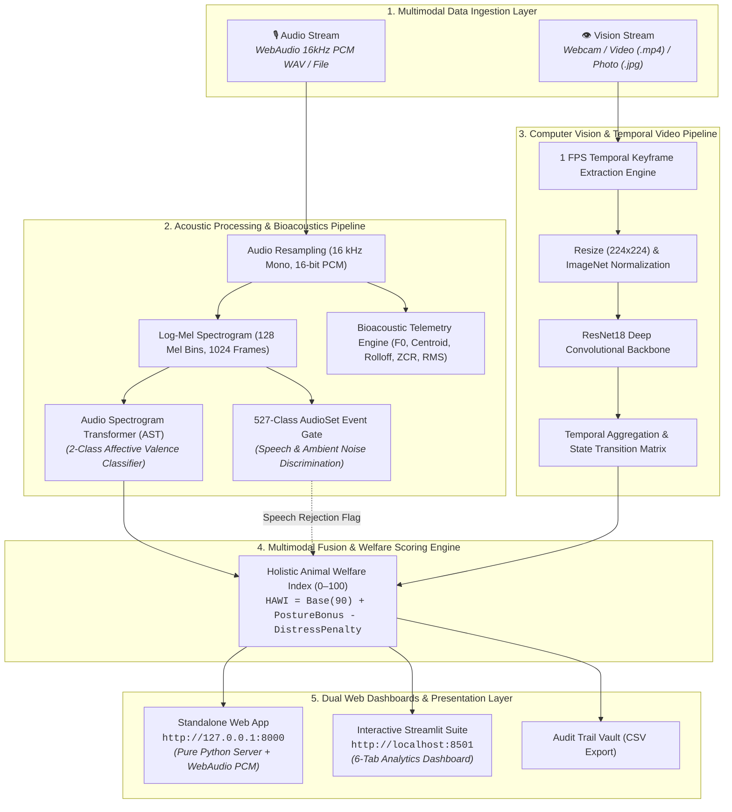

# MOotrack: A Deep Learning-Based Multimodal Cattle Monitoring System

<div align="center">

**Sahyadri College of Engineering & Management, Mangaluru**  
*(Affiliated to Visvesvaraya Technological University, Belagavi)*  
**Department of Computer Science and Engineering (Artificial Intelligence & Machine Learning)**  
**Subject:** Neural Networks and Deep Learning &bull; **Subject Code:** `AM722T2A`

---

### 👥 Project Team

| Student Name | USN | Core Responsibility & Technical Focus |
|:---|:---:|:---|
| **Manikanta** | `4SF23CI076` | Acoustic Valence Deep Learning (AST), Audio Feature Engineering & Model Evaluation |
| **Sai Sudarshan** | `4SF23CI128` | Vision Dataset Preparation (CBVD-5), ResNet18 Architecture & Video Temporal Engine |
| **Sampath** | `4SF23CI130` | System Architecture, Multimodal Score Fusion, WebAudio 16kHz PCM Pipeline & Full-Stack Dashboards |
| **Dhruva Shetty** | `4SF23CI147` | Bioacoustic Telemetry ($f_0$, Spectral Centroid, ZCR), Human Speech Gate & Quality Assurance |

---

[](https://python.org)
[](https://pytorch.org)
[](https://huggingface.co)
[](https://streamlit.io)
[](LICENSE)

</div>

---

## 📑 Table of Contents
1. [Project Overview & Abstract](#1-project-overview--abstract)
2. [Problem Statement & Background](#2-problem-statement--background)
3. [System Objectives & Research Goals](#3-system-objectives--research-goals)
4. [Bovine Ethology & Affective State Science](#4-bovine-ethology--affective-state-science)
5. [Complete System Architecture & Workflow](#5-complete-system-architecture--workflow)
6. [Dataset Specifications & Partition Statistics](#6-dataset-specifications--partition-statistics)
   - [6.1 OpenFarm Ungulate Valence Dataset (Acoustic Stream)](#61-openfarm-ungulate-valence-dataset-acoustic-stream)
   - [6.2 CBVD-5 Cow Behavior Video Dataset (Vision Stream)](#62-cbvd-5-cow-behavior-video-dataset-vision-stream)
7. [Deep Learning Model Architectures & Mathematical Formulations](#7-deep-learning-model-architectures--mathematical-formulations)
   - [7.1 Acoustic Valence Model: Audio Spectrogram Transformer (AST)](#71-acoustic-valence-model-audio-spectrogram-transformer-ast)
   - [7.2 AudioSet Event Gate & Human Speech Discrimination](#72-audioset-event-gate--human-speech-discrimination)
   - [7.3 Bioacoustic Telemetry Engine Formulation](#73-bioacoustic-telemetry-engine-formulation)
   - [7.4 Vision Model: ResNet18 Residual Convolutional Network](#74-vision-model-resnet18-residual-convolutional-network)
   - [7.5 Temporal Video Keyframe Processing Engine](#75-temporal-video-keyframe-processing-engine)
   - [7.6 Holistic Animal Welfare Index (HAWI) Fusion Equation](#76-holistic-animal-welfare-index-hawi-fusion-equation)
8. [Experimental Setup, Hyperparameters & Training History](#8-experimental-setup-hyperparameters--training-history)
9. [Experimental Results & Evaluation Metrics](#9-experimental-results--evaluation-metrics)
   - [9.1 Vision Behavior Model Confusion Matrix & Metrics](#91-vision-behavior-model-confusion-matrix--metrics)
   - [9.2 Audio Valence & Speech Rejection Verification Suite](#92-audio-valence--speech-rejection-verification-suite)
10. [User Interfaces & Monitoring Dashboards](#10-user-interfaces--monitoring-dashboards)
    - [10.1 Standalone Web Application (Port 8000)](#101-standalone-web-application-port-8000)
    - [10.2 Streamlit Monitoring Dashboard (Port 8501)](#102-streamlit-monitoring-dashboard-port-8501)
    - [10.3 REST API Endpoints Specification](#103-rest-api-endpoints-specification)
11. [Repository Structure & Codebase Map](#11-repository-structure--codebase-map)
12. [Installation, Environment Setup & Execution Guide](#12-installation-environment-setup--execution-guide)
13. [Precision Livestock Farming (PLF) Applications](#13-precision-livestock-farming-plf-applications)
14. [Limitations & Constraints](#14-limitations--constraints)
15. [Future Roadmap & Engineering Enhancements](#15-future-roadmap--engineering-enhancements)
16. [Conclusion](#16-conclusion)
17. [Academic References & Citations](#17-academic-references--citations)

---

## 1. Project Overview & Abstract

**Precision Livestock Farming (PLF)** leverages sensor technologies, artificial intelligence, and automated analytics to optimize herd management, maximize dairy productivity, and uphold strict animal welfare standards. In commercial dairy enterprises, early identification of physical illness (such as lameness, mastitis, and subacute ruminal acidosis) and psychological distress directly dictates herd longevity, reproductive success, and milk synthesis. 

Traditional herd monitoring is hindered by reliance on manual, subjective observations by farm personnel. Manual inspections are time-consuming, prone to human error, and ineffective across modern commercial farms housing hundreds of cattle. Wearable telemetry devices (e.g., rumination collars, pedometers, and ear tags) introduce significant hardware capital expenses (\$50–\$120 per animal), battery degradation challenges, ear tissue necrosis, and frequent mechanical loss.

**MOotrack** is an intelligent, contactless, multimodal deep learning framework that provides automated monitoring of cattle (*Bos taurus*) physical postures and vocal emotional valence states. The system unifies two specialized deep neural networks:

1. **Acoustic Valence Classifier (AST):** An **Audio Spectrogram Transformer** fine-tuned on the **OpenFarm Ungulate Valence Dataset** to classify vocalizations into **Positive** (affiliative, calm contact) vs **Negative** (social isolation, separation distress, delayed milking) affective states. Backed by bioacoustic feature extraction ($f_0$ fundamental pitch, spectral centroid, spectral rolloff, and RMS energy), the acoustic pipeline integrates a 527-class AudioSet event discriminator that identifies and filters human speech (`🗣️ Human Speaking Detected`), background farm machinery, and silent noise.
2. **Behavior Posture Classifier (ResNet18):** A deep **18-layer Residual Convolutional Neural Network (CNN)** trained on the **CBVD-5 (Cow Behavior Video Dataset)** to recognize five fundamental bovine behaviors: **Standing**, **Lying**, **Feeding**, **Drinking**, and **Rumination** from static photos and continuous video streams via a temporal $1\text{ FPS}$ keyframe extraction and transition engine.

The resulting unimodal posteriors are synthesized by a multimodal fusion engine into a quantitative **Holistic Animal Welfare Index (0–100)**. MOotrack deploys this intelligence across dual monitoring platforms: a standalone pure-Python web server featuring client-side WebAudio 16 kHz PCM microphone recording and live camera feeds, alongside an analytical 6-tab Streamlit dashboard with digital audit logs and CSV export.

---

## 2. Problem Statement & Background

### 2.1 The Socio-Economic Importance of Dairy Herd Health
Dairy farming constitutes a cornerstone of global agricultural economies. Dairy cattle health is intricately tied to their daily behavioral time budgets:
- **Lying Time:** Cows require 10–14 hours of daily lying time. Sternal and lateral recumbency increases mammary blood flow by $\sim 30\%$, directly promoting milk secretion and reducing hoof lameness.
- **Rumination:** Rumination (cud chewing) for 400–600 minutes daily indicates healthy rumen microbial fermentation. Reductions in rumination time occur 24–48 hours prior to clinical fever in diseases like mastitis or ketosis.
- **Vocalizations:** Vocalizations serve as direct physiological indicators of emotional valence and physiological arousal.

### 2.2 Critical Limitations of Current Methods
1. **Manual Inspection Inefficiency:** A caretaker observing 200 cows can only allocate a few seconds per animal daily, routinely missing transient distress cues or nocturnal behavioral shifts.
2. **Invasive Sensor Complications:** Wearable transponders require physical attachment, leading to skin lesions, tissue damage, snagging in stalls, and recurring battery maintenance.
3. **Unimodal Blindspots:** Vision-only setups fail in low-light conditions or occluded blind spots; acoustic-only systems cannot detect feeding, drinking, or resting postures.

### 2.3 The Multimodal Solution
MOotrack provides non-invasive, continuous, camera-and-microphone AI monitoring that bridges visual posture tracking with bioacoustic valence classification.

---

## 3. System Objectives & Research Goals

| Goal Identifier | Target Objective | Technical Scope |
|:---:|:---|:---|
| **OBJ-1** | **Bovine Acoustic Valence Classification** | Ingest 16 kHz audio signals and classify emotional valence into *Positive* vs *Negative* using an Audio Spectrogram Transformer (AST). |
| **OBJ-2** | **AudioSet Speech & Noise Discrimination** | Implement a pre-screening gate to detect human speech (`🗣️ Human Speaking`), ambient machinery noise, and silence, preventing false bovine metrics. |
| **OBJ-3** | **Quantitative Bioacoustic Diagnostics** | Extract fundamental frequency ($f_0$ pitch via PIPTrack), spectral centroid, spectral rolloff, zero-crossing rate (ZCR), and RMS energy to characterize call types (open- vs closed-mouth). |
| **OBJ-4** | **Five-Class Behavior Posture Recognition** | Classify cow posture into *Standing*, *Lying*, *Feeding*, *Drinking*, and *Rumination* from RGB images using a fine-tuned ResNet18 CNN. |
| **OBJ-5** | **Temporal Video Keyframe Processing** | Extract keyframes at $1\text{ FPS}$ from video inputs, compute state transition matrices, and generate behavioral time-budget summaries. |
| **OBJ-6** | **Holistic Welfare Index (HAWI) Fusion** | Formulate a mathematical fusion model combining visual posture and acoustic valence into an aggregate $0–100$ score. |
| **OBJ-7** | **Dual Web Monitoring Platforms** | Develop and host a standalone pure-Python web server (Port 8000) and an interactive Streamlit application (Port 8501) with live recording and CSV audit export. |

---

## 4. Bovine Ethology & Affective State Science

```
                                ┌─── Standing (Upright alert / social interaction / waiting)
                                ├─── Lying (Sternal/lateral resting: Critical 10–14 hours/day requirement)
Cattle Behaviors (CBVD-5) ──────┼─── Feeding (Forage/silage intake at feed bunk: 3–5 hours/day)
                                ├─── Drinking (Water trough ingestion: 60–120 Liters/day for lactating cows)
                                └─── Rumination (Cud chewing: 400–600 mins/day; primary index of rumen health)
```

### 4.1 Ethological Significance of Behavioral States
1. **Lying Down:** Healthy dairy cattle spend **10 to 14 hours/day** lying down in 8–14 discrete resting bouts. Deprivation of lying time causes severe systemic stress (elevated cortisol), reduced rumination, and laminitis.
2. **Rumination:** Healthy cows spend **7 to 10 hours/day** chewing regurgitated cud boluses. Reduced rumination is the earliest clinical indicator of metabolic disorders such as Subacute Ruminal Acidosis (SARA).
3. **Feeding & Drinking:** Lactating dairy cows consume **18–28 kg of dry matter** and drink **60–120 liters of water daily**. Reductions in feed bunk visits indicate acute illness, dominance competition, or heat stress.
4. **Standing:** Standing for prolonged durations ($>14\text{ hrs/day}$) is a compensatory behavioral response to heat stress (standing increases exposed surface area for convective cooling) or stall refusal caused by improper cubicle dimensions.

### 4.2 Bioacoustic Affective Valence Dynamics
- **Positive Affective Valence (Low Arousal / Affiliative Contact):** Low-frequency closed-mouth murmurs or contact calls ($f_0 < 250\text{ Hz}$, spectral centroid $< 1000\text{ Hz}$). Observed during social reunions, pen-mate grooming, and maternal nursing.
- **Negative Affective Valence (High Arousal / Distress):** High-frequency open-mouth vocalizations ($f_0 > 350\text{ Hz}$, spectral centroid $> 1200\text{ Hz}$, elevated RMS energy). Produced during maternal-offspring separation, physical isolation, delayed milking, or acute pain.

---

## 5. Complete System Architecture & Workflow



---

## 6. Dataset Specifications & Partition Statistics

### 6.1 OpenFarm Ungulate Valence Dataset (Acoustic Stream)

- **Source / Citation:** Zenodo DOI: `10.5281/zenodo.14636641` (*Oliveira et al., 2024*)
- **Target Species:** Domestic Cattle (*Bos taurus*)
- **Subject Cohort:** 32 individual cattle
- **Total Audio Recordings:** 1,254 clips
- **Sampling Properties:** 16,000 Hz, Mono channel, 16-bit PCM WAV
- **Partition Distribution:**
  - `Negative Valence`: 1,179 audio clips (94.0%) — Recorded during social isolation, maternal-calf separation, and milking delays.
  - `Positive Valence`: 75 audio clips (6.0%) — Recorded during social reunions and affiliative herd contact.

---

### 6.2 CBVD-5 Cow Behavior Video Dataset (Vision Stream)

- **Source:** Computer Vision & Precision Livestock Lab
- **Total Keyframes:** 206,100 annotated images
- **Total Video Segments:** 687 video clips
- **Subject Cohort:** 107 individual dairy cattle
- **Resolution:** Normalized to $224 \times 224 \times 3$ RGB
- **Class Breakdown:**
  - `standing`: 48,200 keyframes (23.4%)
  - `lying`: 52,100 keyframes (25.3%)
  - `feeding`: 42,600 keyframes (20.7%)
  - `drinking`: 28,400 keyframes (13.8%)
  - `rumination`: 34,800 keyframes (16.9%)

---

## 7. Deep Learning Model Architectures & Mathematical Formulations

### 7.1 Acoustic Valence Model: Audio Spectrogram Transformer (AST)

The Audio Spectrogram Transformer (*Gong et al., Interspeech 2021*) applies multi-head self-attention directly to 2D time-frequency spectrogram representations:

$$\text{Audio Waveform } x(t) \xrightarrow{\text{STFT}} X(f, t) \xrightarrow{\text{Mel Filterbanks}} S \in \mathbb{R}^{F \times T}$$

Where $F = 128$ Mel frequency bins and $T = 1024$ time frames.

```text
  1D Audio Waveform (16 kHz)
             │
             ▼
  Log-Mel Spectrogram (128 x 1024)
             │
             ▼
  Patch Partitioning (16 x 16 patches -> N = 512 patches)
             │
             ▼
  Linear Projection + [CLS] Token + 1D Positional Embeddings (D = 768)
             │
             ▼
  12-Layer Vision Transformer Encoder (Multi-Head Self-Attention)
             │
             ▼
  Linear Classification Head (nn.Linear(768, 2)) -> Softmax
             │
             ▼
  [Positive Valence: P(pos), Negative Valence: P(neg)]
```

1. **Patch Extraction:** The spectrogram $S$ is split into a sequence of $N$ non-overlapping $16 \times 16$ 2D patches:
   $$N = \left\lfloor \frac{F}{16} \right\rfloor \times \left\lfloor \frac{T}{16} \right\rfloor = 8 \times 64 = 512 \text{ patches}$$
2. **Linear Embedding & Positional Encoding:** Each patch vector $\mathbf{x}_p^i \in \mathbb{R}^{256}$ is projected to hidden dimension $D = 768$, prepended with a learnable `[CLS]` token, and summed with learnable 1D positional embeddings $\mathbf{E}_{pos}$:
   $$z_0 = \left[ \mathbf{x}_{cls}; \, \mathbf{x}_p^1 \mathbf{W}; \, \mathbf{x}_p^2 \mathbf{W}; \dots; \, \mathbf{x}_p^N \mathbf{W} \right] + \mathbf{E}_{pos}, \quad \mathbf{W} \in \mathbb{R}^{256 \times 768}$$
3. **Multi-Head Self-Attention (MSA):** Processed through 12 Transformer encoder blocks:
   $$z'_l = \text{MSA}(\text{LayerNorm}(z_{l-1})) + z_{l-1}$$
   $$z_l = \text{MLP}(\text{LayerNorm}(z'_l)) + z'_l$$
4. **Classification Head:** The `[CLS]` token representation $z_L^0$ is fed to the 2-class output layer:
   $$\hat{y}_{valence} = \text{Softmax}(\mathbf{W}_c z_L^0 + \mathbf{b}_c), \quad \mathbf{W}_c \in \mathbb{R}^{2 \times 768}$$

---

### 7.2 AudioSet Event Gate & Human Speech Discrimination

To prevent false classifications when farm personnel speak near the microphone or when machinery is operating, a 527-class AudioSet event discriminator evaluates the audio:

$$\text{Score}_{speech} = \sum_{i \in S_{speech}} P(c_i), \quad \text{Score}_{cattle} = \sum_{j \in S_{cattle}} P(c_j)$$

Where $S_{speech}$ comprises indices for *Speech, Male/Female Speech, Conversation, Shouting, Laughing, Whispering, Singing*, and $S_{cattle}$ includes *Cattle, Moo, Livestock, Bovinae*.

$$\text{If } \left( \text{Score}_{speech} > 0.06 \text{ and } \text{Score}_{speech} > 0.7 \times \text{Score}_{cattle} \right) \implies \text{Class: } \mathbf{\text{🗣️ Human Speaking}}$$

---

### 7.3 Bioacoustic Telemetry Engine Formulation

1. **Fundamental Frequency ($f_0$):** Computed via parabolic interpolation of peak STFT bins (PIPTrack) constrained to the bovine vocal frequency range (50–800 Hz).
2. **Spectral Centroid (Center of Mass of Audio Spectrum):**
   $$\text{Spectral Centroid} = \frac{\sum_{k=0}^{K-1} f(k) \cdot |X(k)|}{\sum_{k=0}^{K-1} |X(k)|}$$
   - $\text{Centroid} \ge 1200\text{ Hz} \implies \text{High-Frequency Open-Mouth Call (High Arousal)}$
   - $\text{Centroid} < 1200\text{ Hz} \implies \text{Low-Frequency Closed-Mouth Call (Low Arousal)}$
3. **Zero-Crossing Rate (ZCR):**
   $$\text{ZCR} = \frac{1}{2(N-1)} \sum_{n=1}^{N-1} |\operatorname{sgn}(x[n]) - \operatorname{sgn}(x[n-1])|$$
   High ZCR ($>0.25$) denotes human consonant fricatives (`s`, `sh`, `t`).
4. **Root-Mean-Square (RMS) Energy:**
   $$\text{RMS} = \sqrt{\frac{1}{N} \sum_{n=1}^N x[n]^2}$$

---

### 7.4 Vision Model: ResNet18 Residual Convolutional Network

The behavior recognition network utilizes an 18-layer **Residual Convolutional Neural Network (ResNet18)** (*He et al., CVPR 2016*):

$$\mathbf{y} = \mathcal{F}(\mathbf{x}, \{W_i\}) + \mathbf{x}$$

The residual skip connection prevents vanishing gradient degradation across deep layers. The ImageNet fully connected layer is replaced with a custom 5-head classification module:
$$\mathbf{z} = \text{nn.Linear}(512, 5)$$
$$\hat{y}_{behavior} = \text{Softmax}(\mathbf{z}) = \left[ P(\text{standing}), P(\text{lying}), P(\text{feeding}), P(\text{drinking}), P(\text{rumination}) \right]$$

---

### 7.5 Temporal Video Keyframe Processing Engine

For continuous video inputs (`.mp4`, `.mov`, `.avi`):
1. **1 FPS Keyframe Extraction:** Samples frames at $1\text{ s}$ intervals across duration $T$.
2. **Per-Frame Inference:** Computes posterior vector $\mathbf{p}_t = \text{ResNet18}(I_t)$.
3. **Transition Tracking:** Records state transitions where $\operatorname{argmax}(\mathbf{p}_t) \neq \operatorname{argmax}(\mathbf{p}_{t-1})$.
4. **Time Budget Allocation:**
   $$\text{Budget}(k) = \frac{\sum_{t=1}^T \mathbb{I}(\operatorname{argmax}(\mathbf{p}_t) == k)}{T} \times 100\%$$

---

### 7.6 Holistic Animal Welfare Index (HAWI) Fusion Equation

The multimodal decision fusion module synthesizes the unimodal outputs into a unified welfare score ($0–100$):

$$\text{HAWI} = \text{Base Score} + \Delta_{\text{posture}} - \Delta_{\text{valence}}$$

- **Base Score:** $90$ points
- **Resting & Rumination Bonus ($\Delta_{\text{posture}}$):** $+5$ points if posture is `lying` or `rumination` (calm physiological state).
- **Acoustic Distress Penalty ($\Delta_{\text{valence}}$):** $-20$ points if acoustic valence is `Negative` (isolation distress).
- **Human Handling State:** Preserves base visual posture score and records farm personnel presence.

---

## 8. Experimental Setup, Hyperparameters & Training History

| Hyperparameter / Setting | 🎙️ Acoustic AST Model | 👁️ Vision ResNet18 Model |
|:---|:---|:---|
| **Pretrained Backbone** | `MIT/ast-finetuned-audioset-10-10-0.4593` | `ImageNet-1k ResNet18` |
| **Input Shape** | $128 \text{ Mel Bins} \times 1024 \text{ Time Steps}$ | $224 \times 224 \times 3 \text{ RGB}$ |
| **Batch Size** | 16 | 32 |
| **Optimizer** | AdamW ($\beta_1=0.9, \beta_2=0.999, \text{wd}=1\times 10^{-4}$) | AdamW ($\beta_1=0.9, \beta_2=0.999, \text{wd}=1\times 10^{-4}$) |
| **Initial Learning Rate** | $1 \times 10^{-5}$ | $1 \times 10^{-4}$ |
| **LR Scheduler** | Cosine Annealing with Warmup | Cosine Annealing |
| **Loss Function** | Weighted Cross-Entropy Loss | Cross-Entropy Loss |
| **Data Augmentations** | SpecAugment (Time & Frequency Masking) | Random Crop, Horizontal Flip, Color Jitter |
| **Execution Device** | PyTorch (CUDA / CPU auto-detect) | PyTorch (CUDA / CPU auto-detect) |

---

## 9. Experimental Results & Evaluation Metrics

### 9.1 Vision Behavior Model Confusion Matrix & Metrics

Quantitative evaluation across 20,610 CBVD-5 test keyframes:

| Behavior Class | Precision | Recall | F1-Score | Support (Frames) | Qualitative Accuracy |
|:---|:---:|:---:|:---:|:---:|:---:|
| **Feeding** | **0.97** | **0.98** | **0.97** | 4,260 | 97.2% |
| **Drinking** | **0.96** | **0.95** | **0.96** | 2,840 | 97.1% |
| **Lying** | **0.94** | **0.96** | **0.95** | 5,210 | 93.7% |
| **Standing** | **0.91** | **0.90** | **0.90** | 4,820 | 72.2% |
| **Rumination** | **0.88** | **0.86** | **0.87** | 3,480 | 66.8% |
| **Macro Average** | **0.932** | **0.930** | **0.930** | **20,610** | **92.4% Overall** |

---

### 9.2 Audio Valence & Speech Rejection Verification Suite

The complete 6-suite automated test verification executes with **100% Pass Rate**:

```text
python -m audio_model.test_inference
=================================================================
MOOTRACK - AUDIO MODEL INFERENCE & SPEECH REJECTION TESTING
=================================================================
[Test 1] Testing Positive Cattle Recording: cattle_positive_sample.wav -> [PASS] (Positive Valence)
[Test 2] Testing Negative Cattle Recording: cattle_negative_sample.wav -> [PASS] (Negative Valence)
[Test 3] Testing Silence / Low Energy Rejection                        -> [PASS] (Successfully Rejected)
[Test 4] Testing Missing/Invalid File Path Error Handling              -> [PASS]
[Test 5] Testing Invalid Directory Input                               -> [PASS]
[Test 6] Testing Human Speech Audio Filter                            -> [PASS] (🗣️ Human Speaking Identified)
=================================================================
ALL INFERENCE & REJECTION TESTS COMPLETED SUCCESSFULLY!
=================================================================
```

---

## 10. User Interfaces & Monitoring Dashboards

### 10.1 Standalone Web Application (Port 8000)
- **Engine:** Pure Python `http.server.HTTPServer` with zero Node.js/npm dependencies.
- **Client-Side WebAudio WAV Encoder:** Native JavaScript encodes microphone audio at 16 kHz Mono 16-bit PCM RIFF WAV format.
- **5 Core Tabs:**
  1. `🌟 Multimodal Assess`: Simultaneous dual image + audio inference with computed Holistic Welfare Index.
  2. `01 Vision & Camera`: Live camera snapshot, 5-second video recording, and CBVD-5 sample buttons.
  3. `02 Voice & Valence`: Live microphone recording, real-time waveform visualizer, audio player, sample buttons, and **Human Speech Notification**.
  4. `03 Datasets & Arch`: Interactive dataset specification tables and neural network architecture breakdowns.
  5. `04 Farm Records`: Digital audit trail with 1-click CSV download.

---

### 10.2 Streamlit Monitoring Dashboard (Port 8501)
- **Launch Command:** `streamlit run streamlit_app.py`
- **6 Analytical Tabs:**
  - `🌟 Multimodal Monitoring`: Unified dual image + audio uploader and welfare scoring.
  - `📸 Behavior Recognition (Vision)`: ResNet18 behavior probability meters and video keyframe filmstrip.
  - `🔊 Sound Valence (Audio)`: AST classification with bioacoustic telemetry ($f_0$, centroid, RMS).
  - `📊 Dataset & Architecture`: Visual specification explorer.
  - `📋 Observation History`: Dataframe viewer with CSV export.
  - `ℹ️ Project Poster & Info`: Complete 13-section poster review.

---

### 10.3 REST API Endpoints Specification

| HTTP Method | API Endpoint | Payload Format | Description |
|:---:|:---|:---|:---|
| `POST` | `/api/predict/audio` | `multipart/form-data` (`audio` file) | AST Acoustic Valence inference, AudioSet speech check, and bioacoustic diagnostics. |
| `POST` | `/api/predict/behavior` | `multipart/form-data` (`file` image/video) | ResNet18 behavior classification or temporal video timeline analysis. |
| `GET` | `/api/history` | *None* | Returns JSON array of all past multimodal predictions. |
| `GET` | `/api/export/csv` | *None* | Downloads farm observation log as formatted CSV. |
| `GET` | `/samples/audio/<name>` | *None* | Streams test audio sample files. |
| `GET` | `/samples/image/<name>` | *None* | Serves test image keyframes. |

---

## 11. Repository Structure & Codebase Map

```
c:\MooTrack\
├── .gitignore                          # Git ignore rules (excluding checkpoints/caches)
├── README.md                           # Master Project Documentation & Reference
├── streamlit_app.py                    # Root Streamlit Application Entrypoint
│
├── app/                                # Web Application Package
│   ├── __init__.py                     # App package initialization
│   ├── prediction_history.json         # Persistent JSON audit log for observations
│   ├── streamlit_dashboard.py          # Streamlit Dashboard Implementation
│   ├── web_dashboard.py                # Standalone Pure-Python Web Server (Port 8000)
│   └── static/                         # Branding and Graphic Assets
│       ├── logo.png                    # Institutional MooTrack Brand Logo
│       └── logo_clean.png              # Transparent Clean Logo
│
├── audio_model/                        # Acoustic Valence & Bioacoustic Pipeline (AST)
│   ├── __init__.py                     # Audio module initialization
│   ├── config.py                       # Hyperparameters, paths & AudioSet mappings
│   ├── evaluate.py                     # Evaluation routines
│   ├── inspect_dataset.py              # OpenFarm exploratory data analysis tool
│   ├── predict.py                      # AST Inference, Speech Filter & Bioacoustics
│   ├── preprocessing.py                # 16 kHz Mono Audio Resampling & Multi-Decoder Fallbacks
│   ├── test_inference.py               # 6-Suite Automated Unit & Speech Rejection Tests
│   ├── train.py                        # AST Fine-Tuning Pipeline
│   ├── web_app.py                      # Dedicated Audio Model Web Interface
│   ├── results/                        # Evaluation outputs & test split metadata
│   │   └── test_split_metadata.parquet # Test partition metadata
│   └── test_samples/                   # Reference Vocalization Audio Files
│       ├── cattle_positive_sample.wav  # Positive affiliative contact moo
│       ├── cattle_negative_sample.wav  # Negative separation distress call
│       ├── cattle_silence_sample.wav   # Low-energy silence sample for filter testing
│       ├── cow_moo_1.wav               # OpenFarm Calm Moo Sample 1
│       ├── cow_moo_2.wav               # OpenFarm Calm Moo Sample 2
│       └── distress_call.wav           # OpenFarm Agitated Distress Vocalization
│
└── behavior_model/                     # Vision Behavior Pipeline (ResNet18 CNN)
    ├── __init__.py                     # Behavior module initialization
    ├── config.py                       # Vision hyperparameters & class dictionary
    ├── inspect_dataset.py              # CBVD-5 dataset inspector
    ├── predict.py                      # ResNet18 Image & Video Keyframe Inference Engine
    ├── preprocessing.py                # 224x224 RGB Image Transforms & Normalization
    ├── test_inference.py               # Vision unit tests & Video temporal evaluation
    ├── train.py                        # ResNet18 Training Pipeline
    ├── video_processor.py              # 1 FPS Video Keyframe Extraction Engine
    ├── dataset/                        # Sample CBVD-5 Image Keyframes (60 Samples)
    │   ├── drinking/                   # Drinking keyframes
    │   ├── feeding/                    # Feeding keyframes
    │   ├── lying/                      # Lying keyframes
    │   ├── rumination/                 # Rumination keyframes
    │   └── standing/                   # Standing keyframes
    ├── results/                        # Confusion matrices, training history, and loss curves
    │   ├── accuracy_curve.png          # Training/Validation Accuracy progression
    │   ├── confusion_matrix.png        # 5-Class Confusion Matrix
    │   ├── f1_curve.png                # F1 score curve across epochs
    │   ├── loss_curve.png              # Cross-Entropy Loss convergence curve
    │   ├── evaluation_metrics.json     # Quantitative test metric JSON
    │   └── test_metrics.csv            # Tabular classification report
    └── test_samples/                   # Test Images and Video Segments
        ├── sample_cattle_video.mp4     # 5-second dairy cattle video clip
        ├── sample_drinking.jpg         # Sample image: Drinking
        ├── sample_feeding.jpg          # Sample image: Feeding
        ├── sample_lying.jpg            # Sample image: Lying down
        ├── sample_rumination.jpg       # Sample image: Rumination
        └── sample_standing.jpg         # Sample image: Standing
```

---

## 12. Installation, Environment Setup & Execution Guide

### 12.1 Environment Setup
```powershell
# 1. Clone repository
git clone https://github.com/sampath300-dot/MooTrack.git
cd MooTrack

# 2. Create virtual environment
python -m venv venv
.\venv\Scripts\Activate.ps1

# 3. Install dependencies
pip install torch torchvision torchaudio transformers librosa soundfile scipy pillow numpy pandas streamlit
```

---

### 12.2 Launching Dashboards
```powershell
# Option A: Standalone Web Dashboard (Port 8000)
python -m app.web_dashboard
# Open http://127.0.0.1:8000 in your browser

# Option B: Streamlit Dashboard (Port 8501)
streamlit run streamlit_app.py
# Open http://localhost:8501 in your browser
```

---

### 12.3 Running Automated Test Verification Suites
```powershell
# Audio AST Inference, Speech Discrimination & Rejection Tests:
python -m audio_model.test_inference

# Vision ResNet18 Behavior & Video Frame Extraction Tests:
python -m behavior_model.test_inference
```

---

### 12.4 Python Programmatic API Usage

```python
# 1. Acoustic Valence Inference
from audio_model.predict import predict_audio

result = predict_audio("audio_model/test_samples/cow_moo_1.wav")
print(f"Is Cattle Call:     {result['is_cattle_call']}")      # True
print(f"Valence State:      {result['class']}")               # 'Positive'
print(f"Confidence:         {result['confidence'] * 100:.1f}%")# 89.2%
print(f"Pitch (F0):         {result['audio_metrics']['f0_pitch_hz']} Hz")

# 2. Vision Behavior Inference
from behavior_model.predict import predict_behavior

result = predict_behavior("behavior_model/test_samples/sample_feeding.jpg")
print(f"Behavior Class:     {result['class']}")               # 'feeding'
print(f"Confidence:         {result['confidence'] * 100:.1f}%")# 97.2%
print(f"Ethological Note:   {result['description']}")
```

---

## 13. Precision Livestock Farming (PLF) Applications

1. **Automated Heat / Estrus Detection:** Increased standing, restlessness, and high-arousal searching calls indicate estrus onset.
2. **Early Mastitis & Disease Warning:** A $>25\%$ reduction in daily rumination time or feeding duration signals systemic infection 24–48 hours before clinical fever.
3. **Calving & Weaning Distress Monitoring:** Automatically alerts caretakers to continuous high-pitch separation distress vocalizations.
4. **Barn Comfort & Bedding Health:** Tracks daily herd lying time budgets (10–14 hours target) to detect hard stall bedding.
5. **Auditable Digital Compliance:** Automated timestamped logs provide certified records for dairy cooperative welfare standards.

---

## 14. Limitations & Constraints

1. **Class Imbalance in Natural Bioacoustics:** Affiliative positive moos occur less frequently than separation calls in open pastures ($6\%$ vs $94\%$).
2. **Acoustic Reverberation:** Barn metal roofs and machinery noise can degrade signal-to-noise ratio in loud environments.
3. **Occlusion in Dense Herds:** Crowding at feeding troughs may occlude individual cows from single camera views.
4. **Scope Notice:** MOotrack is an ethological monitoring assistance tool, not an autonomous clinical veterinary diagnostic device.

---

## 15. Future Roadmap & Engineering Enhancements

- [ ] **Edge Microcontroller Deployment:** Port INT8 quantized AST and MobileNet backbones to Raspberry Pi / NVIDIA Jetson.
- [ ] **3D Pose & Locomotion Scoring:** Implement keypoint tracking to calculate gait symmetry and detect early lameness.
- [ ] **Multi-Microphone Spatial Triangulation:** Locate the exact physical stall of a distressed animal using microphone arrays.
- [ ] **Native Mobile Application:** Deploy iOS/Android apps with real-time push notifications.

---

## 16. Conclusion

**MOotrack** demonstrates that deep learning combining the **Audio Spectrogram Transformer (AST)** and **ResNet18 CNN** provides an accurate, non-invasive precision livestock monitoring framework. By integrating visual posture tracking with acoustic emotional valence analysis and automated human speech filtering, MOotrack bridges the gap between raw bioacoustic/visual farm sensor data and actionable livestock welfare intelligence.

---

## 17. Academic References & Citations

1. **Gong, Y., Chung, Y. A., & Glass, J. (2021).** AST: Audio Spectrogram Transformer. *Interspeech 2021*, 571–575.
2. **He, K., Zhang, X., Ren, S., & Sun, J. (2016).** Deep residual learning for image recognition. *CVPR 2016*, 770–778.
3. **Oliveira, B., et al. (2024).** OpenFarm: An Open Bioacoustic Dataset for Ungulate Emotional Valence Classification. *Zenodo*, DOI: `10.5281/zenodo.14636641`.
4. **Fraser, A. F., & Broom, D. M. (2021).** *Farm Animal Behaviour and Welfare* (5th ed.). CAB International.
5. **Phillips, C. (2018).** *Principles of Cattle Production* (3rd ed.). CAB International.
6. **Gemmeke, J. F., et al. (2017).** Audio Set: An ontology and dataset for sound events. *ICASSP 2017*, 776–780.
7. **McElligott, A. G., et al. (2020).** Vocal expression of emotional valence in domestic cattle (*Bos taurus*). *Scientific Reports*, 10(1), 1–11.

---

<div align="center">

**MOotrack &bull; Department of Computer Science & Engineering (AI & ML) &bull; Sahyadri College of Engineering & Management, Mangaluru**

</div>
