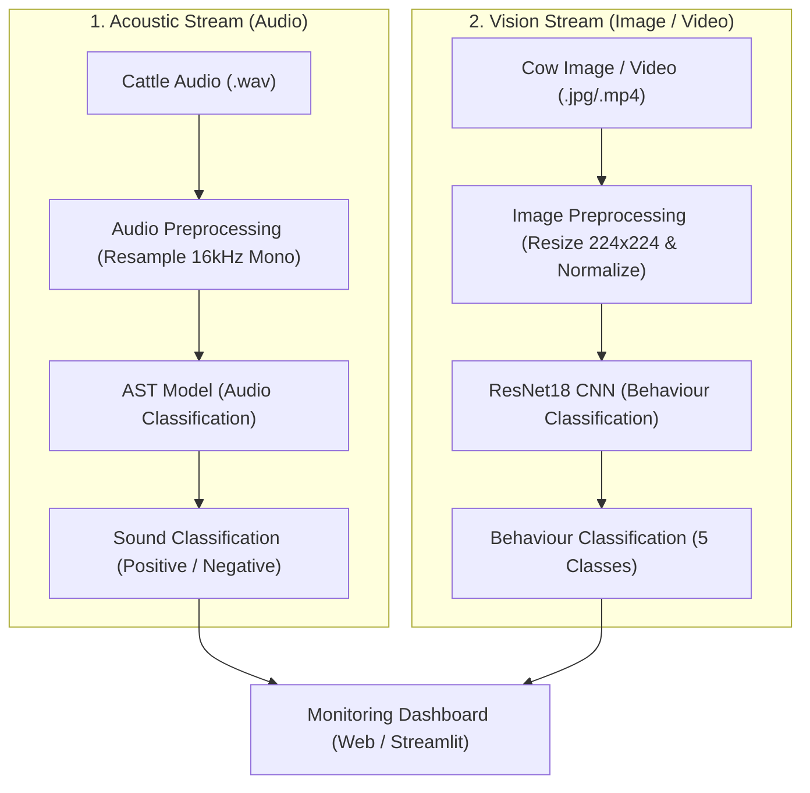

# MOotrack: A Deep Learning-Based Multimodal Cattle Monitoring System

**Sahyadri College of Engineering & Management, Mangaluru**  
*(Affiliated to Visvesvaraya Technological University, Belagavi)*  
**Department of Computer Science and Engineering (Artificial Intelligence & Machine Learning)**  
**Subject:** Neural Networks and Deep Learning | **Subject Code:** AM722T2A  

---

## 👥 Project Team

| Sl. No. | Student Name | University Seat Number (USN) |
|---|---|---|
| 1 | **Manikanta** | `4SF23CI076` |
| 2 | **Sai Sudarshan** | `4SF23CI128` |
| 3 | **Sampath** | `4SF23CI130` |
| 4 | **Dhruva Shetty** | `4SF23CI147` |

---

## 1. Problem Statement
Farmers rely on manual observation to understand cattle behaviour, which is time-consuming and may lead to missed signs of health or behavioural changes. In large herds, it becomes difficult to monitor each animal continuously.  
**MOotrack** analyses cattle audio and images to identify sound patterns and visible behaviours, and presents the results through a simple web dashboard.

---

## 2. Objectives
1. **Acoustic & Behavioral Analysis:** Develop an intelligent precision livestock farming (PLF) system to analyse cattle sounds and behaviour.
2. **Emotional Valence Recognition:** Identify positive and negative patterns in cattle vocalizations (mooing).
3. **Five-Class Behavior Recognition:** Recognize five common cattle behaviours from images and video keyframes (Standing, Lying, Feeding, Drinking, Rumination).
4. **Confidence Metrics:** Provide real-time prediction and confidence information.
5. **Interactive Web Dashboard:** Create a simple web dashboard for easy, accessible monitoring by farmers and farm staff.

---

## 3. Proposed System Workflow



---

## 4. System Architecture

```text
                                     MOotrack System
                                            │
            ┌───────────────────────────────┴───────────────────────────────┐
            ▼                                                               ▼
    [Upload Cattle Audio]                                           [Upload Cow Image]
            │                                                               │
    Audio Model (AST)                                               Behaviour Model (ResNet18)
            │                                                               │
    Sound Valence (Positive / Negative)                             Cattle Behaviour (5 Classes)
    Confidence Score                                                Confidence Score
            │                                                               │
            └───────────────────────────────┬───────────────────────────────┘
                                            ▼
                                     [Web Dashboard]
                             • View Results & Predictions
                             • Unified Multimodal Assessment
                             • Observation History & Export
                             • Simple Farmer-Friendly Interface
```

---

## 5. Datasets

### 🎙️ Audio Dataset: OpenFarm Ungulate Valence Dataset
- **Source:** Zenodo DOI: `10.5281/zenodo.14636641` / Hugging Face `oliveirabruno01/openfarm-ungulate-valence`
- **Total Samples:** 1,254 audio clips
- **Individual Cattle:** 32 individual cattle
- **Species:** *Bos taurus* (Domestic Cattle)
- **Target Classes:** 2 Classes (*Negative* vs *Positive*)
  - `Negative`: 1,179 samples (94.0%) — Social separation context
  - `Positive`: 75 samples (6.0%) — Social reunion context

### 👁️ Behaviour Dataset: CBVD-5 (Cow Behavior Video Dataset)
- **Source:** Kaggle / Computer Vision Lab
- **Total Images:** 206,100 keyframes
- **Video Segments:** 687 video clips
- **Individual Cattle:** 107 individual cattle
- **Target Classes:** 5 Classes
  - `standing`: Upright alert, resting, or socializing posture
  - `lying`: Resting in sternal/lateral recumbency (critical for welfare: 10–14 hrs/day)
  - `feeding`: Actively consuming forage, silage, or concentrate
  - `drinking`: Ingesting water at the drinker (vital for milk yield: 60–120 L/day)
  - `rumination`: Rhythmic cud chewing (primary indicator of rumen health)

---

## 6. Deep Learning Models

### 1. Audio Model — Audio Spectrogram Transformer (AST)
- **Base Architecture:** `MIT/ast-finetuned-audioset-10-10-0.4593`
- **Fine-Tuning:** Custom linear classification head for 2-class valence
- **Input:** 16 kHz Mono Audio $\rightarrow$ Log-Mel Spectrogram (128 Mel bins, 1024 max length)
- **Rejection Layer:** AudioSet base probabilities filter out human speech, machinery noise, and silence.
- **Output:** Positive / Negative Valence + Bioacoustic Signal Diagnostics (Pitch $f_0$, Spectral Centroid, RMS Energy, Call-Type Classification).

### 2. Behaviour Model — ResNet18 CNN
- **Base Architecture:** ResNet18 Convolutional Neural Network (Pre-trained on ImageNet-1k)
- **Fine-Tuning:** Customized 5-class linear head (`nn.Linear(512, 5)`)
- **Input:** $224 \times 224$ RGB images / video frames with ImageNet normalization
- **Video Pipeline:** 1 fps temporal keyframe extraction + majority vote and transition detection
- **Output:** 5 Behaviour Classes + Ethological Advice.

---

## 7. Model Output Examples

| Modality | Input Preview | Predicted Output | Confidence | Context |
|---|---|---|---|---|
| **Audio Prediction** | `cow_moo_1.wav` | **Positive** | **89%** | Calm, low-frequency contact call during social proximity |
| **Audio Prediction** | `distress_call.wav` | **Negative** | **92%** | High-frequency vocalization during social separation / distress |
| **Image Prediction** | `sample_feeding.jpg` | **Feeding** | **97%** | Active forage consumption at feed bunk |
| **Image Prediction** | `sample_lying.jpg` | **Lying** | **94%** | Resting posture supporting rumen fermentation and hoof recovery |

---

## 8. Key Features
- 🎙️ **Cattle sound classification:** Classifies bovine vocalizations into Positive or Negative valence.
- 👁️ **Five behaviour recognition from images:** Standing, Lying, Feeding, Drinking, Rumination.
- 📊 **Prediction confidence:** Quantitative probability distribution across all target classes.
- 🌟 **Multimodal dual-stream analysis:** Unified assessment combining visual posture and acoustic tone in one system.
- 🌐 **Web-based monitoring dashboard:** Modern standalone web UI with live mic recording, camera feed, and audio player.
- 🚀 **Streamlit application:** Full-featured interactive dashboard (`streamlit run streamlit_app.py`).
- 📋 **Prediction history & CSV export:** Digital records of observations for farm audits.

---

## 9. Technology Stack


---

## 10. Applications
- **Cattle behaviour monitoring:** Continuous tracking of individual and herd activities.
- **Assist farmers and farm staff:** Instant visual and vocal status checks from mobile or desktop.
- **Identify unusual sound patterns:** Rapid alert when separation or pain vocalizations occur.
- **Digital record of observations:** Automated audit log with timestamps and confidence scores.
- **Support cattle management:** Early intervention for improved herd comfort and milk production.

---

## 11. Limitations
- System performance depends on dataset quality and class distributions.
- Environmental acoustic noise (wind, machinery) and low-light image conditions may impact confidence.
- Currently a research and monitoring assistance prototype.
- **Disclaimer:** Not designed for, nor should it be described as, veterinary disease diagnosis or clinical prescription.
- First version operates on keyframe/clip evaluation rather than whole-barn IoT camera arrays.

---

## 12. Future Enhancements
- Real-time 24/7 edge microphone sound monitoring in the barn.
- Native mobile application for Android/iOS with push notifications.
- Expansion to larger datasets across multiple bovine breeds.
- Detection of novel, unknown sounds (coughing, wheezing, environmental alarms).
- Detailed 3D pose estimation and lameness locomotion scoring.

---

## 13. Conclusion
**MOotrack** combines cattle sound analysis and image-based behaviour recognition in a single monitoring system. The system provides predictions and confidence information through a simple web interface, which can help in better cattle management and animal welfare assessment.

---

## 14. Quick Start & Execution

### 1. Launch Standalone Web Dashboard:
```powershell
python -m app.web_dashboard
```
Open [http://127.0.0.1:8000](http://127.0.0.1:8000) in your browser.

### 2. Launch Streamlit Application:
```powershell
streamlit run streamlit_app.py
```
Open [http://localhost:8501](http://localhost:8501) in your browser.

### 3. Python API Usage:

#### Acoustic Inference:
```python
from audio_model.predict import predict_audio

result = predict_audio("audio_model/test_samples/cow_moo_1.wav")
print(result["class"])       # 'Positive'
print(result["confidence"])  # 0.89
```

#### Vision Inference:
```python
from behavior_model.predict import predict_behavior

result = predict_behavior("behavior_model/test_samples/sample_feeding.jpg")
print(result["class"])       # 'feeding'
print(result["confidence"])  # 0.97
```

### 4. Run Test Verification Suites:
```powershell
python -m audio_model.test_inference
python -m behavior_model.test_inference
```
