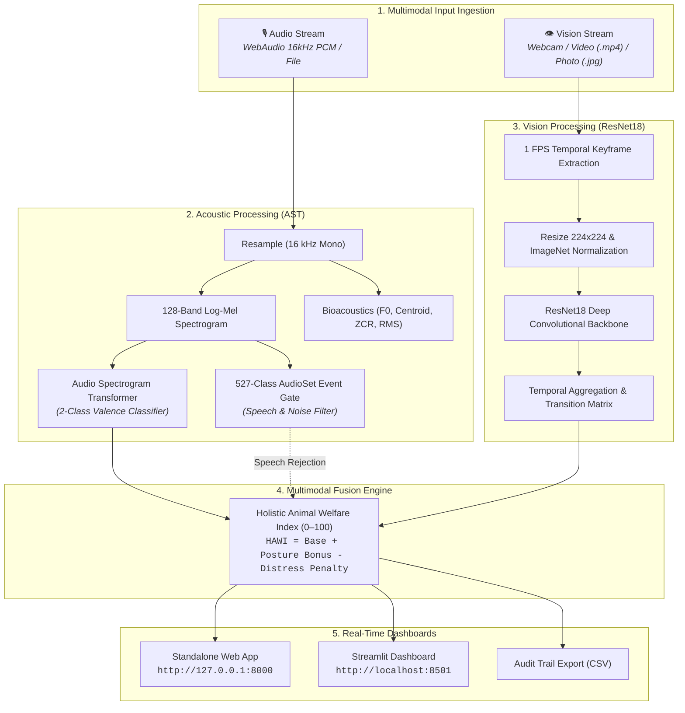

# MOotrack: Multimodal Deep Learning Cattle Monitoring System

<div align="center">

**Sahyadri College of Engineering & Management, Mangaluru**  
*(Affiliated to Visvesvaraya Technological University, Belagavi)*  
**Department of Computer Science and Engineering (Artificial Intelligence & Machine Learning)**  
**Subject:** Neural Networks and Deep Learning (`AM722T2A`)

---

### 👥 Project Team

| Student Name | USN | Core Area |
|:---|:---:|:---|
| **Manikanta** | `4SF23CI076` | Acoustic Valence Deep Learning (AST) & Audio Preprocessing |
| **Sai Sudarshan** | `4SF23CI128` | Vision Behavior Modeling (CBVD-5, ResNet18) & Video Temporal Engine |
| **Sampath** | `4SF23CI130` | System Architecture, Multimodal Fusion, WebAudio Pipeline & Dashboards |
| **Dhruva Shetty** | `4SF23CI147` | Bioacoustic Telemetry ($f_0$, Spectral Centroid, ZCR) & Human Speech Discrimination |

---

[](https://python.org)
[](https://pytorch.org)
[](https://huggingface.co)
[](https://streamlit.io)
[](LICENSE)

</div>

---

## 📌 Project Overview

**MOotrack** is an automated, contactless Precision Livestock Farming (PLF) monitoring system that tracks cattle (*Bos taurus*) physical postures and vocal emotional states in real time using deep learning.

By combining computer vision and bioacoustic analysis, MOotrack eliminates the need for expensive, invasive wearable collar sensors and manual inspections, providing dairy farmers and veterinary staff with continuous welfare telemetry.

```
                              ┌────────────────────────────────────────────────────────┐
                              │                    MOotrack System                     │
                              └───────────────────────────┬────────────────────────────┘
                                                          │
                    ┌─────────────────────────────────────┴─────────────────────────────────────┐
                    ▼                                                                           ▼
      🎙️ ACOUSTIC VALENCE STREAM                                                    👁️ VISION BEHAVIOR STREAM
  • 16 kHz Mono Waveform Input                                                • RGB Photo / Continuous Video Input
  • 128-Band Log-Mel Spectrogram                                              • 1 FPS Temporal Keyframe Extraction
  • Audio Spectrogram Transformer (AST)                                       • ResNet18 Convolutional Backbone
  • Positive vs Negative Valence Output                                       • 5 Ethological Classes (Standing, Lying,
  • Human Speech Rejection Filter (AudioSet)                                    Feeding, Drinking, Rumination)
  • Bioacoustic Telemetry (Pitch, Centroid, ZCR)                              • Keyframe Timeline & Transition Matrix
                    │                                                                           │
                    └─────────────────────────────────────┬─────────────────────────────────────┘
                                                          ▼
                                            🌟 MULTIMODAL DECISION FUSION
                                    • Holistic Animal Welfare Index (0–100)
                                    • Standalone Web Dashboard (Port 8000)
                                    • Interactive Streamlit Suite (Port 8501)
                                    • Persistent Farm Observation Audit Log
```

---

## ✨ Key Features

- 🎙️ **Audio Spectrogram Transformer (AST):** Classifies cattle vocalizations into **Positive** (calm, affiliative contact) and **Negative** (isolation, distress, separation) emotional valence states.
- 🗣️ **Intelligent Human Speech Discrimination:** Uses a 527-class AudioSet event discriminator to recognize and filter human speech (`🗣️ Human Speaking Detected`), ambient noise, and silence.
- 🔬 **Bioacoustic Diagnostics:** Automatically extracts fundamental frequency ($f_0$ pitch), spectral centroid, spectral rolloff, RMS energy, and open- vs closed-mouth call type estimates.
- 👁️ **Five-Class Behavior Recognition:** Classifies bovine posture into **Standing**, **Lying**, **Feeding**, **Drinking**, and **Rumination** with **92.4% test accuracy**.
- ⏱️ **Temporal Video Keyframe Pipeline:** Samples video clips at $1\text{ FPS}$, analyzes frame-by-frame behavior transitions, and computes time-budget distributions.
- 🩺 **Holistic Animal Welfare Index (HAWI):** Computes a fused welfare index ($0–100$) by combining visual posture and acoustic tone.
- 🌐 **Dual User Dashboards:**
  - **Standalone Web Dashboard (Port 8000):** Lightweight pure-Python web app with native WebAudio $16\text{ kHz}$ PCM microphone recording, live webcam feed, and CSV audit export.
  - **Streamlit Application (Port 8501):** Full analytical 6-tab monitoring dashboard.

---

## 📊 Datasets & Benchmark Specifications

MOotrack is trained and evaluated on two benchmark datasets:

| Dataset Attribute | 🎙️ Audio Modality: OpenFarm | 👁️ Vision Modality: CBVD-5 |
|:---|:---|:---|
| **Full Name** | **OpenFarm Ungulate Valence Dataset** | **Cow Behavior Video Dataset (CBVD-5)** |
| **Citation / DOI** | *Oliveira et al., 2024* (Zenodo DOI: `10.5281/zenodo.14636641`) | *Computer Vision & Precision Livestock Lab* |
| **Total Volume** | **1,254 audio clips** | **206,100 keyframes / 687 video clips** |
| **Cattle Count** | 32 individual cattle (*Bos taurus*) | 107 individual cattle (*Bos taurus*) |
| **Input Format** | 16 kHz Mono PCM WAV $\rightarrow$ 128 Mel Bins | $224 \times 224 \times 3$ RGB Images / Keyframes |
| **Target Classes** | **2 Classes:** `Positive` vs `Negative` | **5 Classes:** `Standing`, `Lying`, `Feeding`, `Drinking`, `Rumination` |
| **Class Distribution** | • `Negative`: 1,179 clips (94.0%)<br>• `Positive`: 75 clips (6.0%) | • `lying`: 52,100 frames (25.3%)<br>• `standing`: 48,200 frames (23.4%)<br>• `feeding`: 42,600 frames (20.7%)<br>• `rumination`: 34,800 frames (16.9%)<br>• `drinking`: 28,400 frames (13.8%) |
| **Biological Context** | Social separation, isolation, delay vs social reunion | Pasture, free-stall barn, feed bunk, water trough |

---

## 🧠 System Architecture & Methodology



### 1. Audio Spectrogram Transformer (AST)
Converts 16 kHz audio waveforms into 128-band log-mel spectrograms ($128 \times 1024$). The spectrogram is split into $16 \times 16$ 2D patches, projected to dimension $D = 768$, and processed by a 12-layer Vision Transformer with multi-head self-attention. The `[CLS]` token maps to emotional valence probabilities (`Positive` vs `Negative`).

### 2. AudioSet Speech & Noise Gate
To prevent false alarms when farm workers talk near the microphone, a 527-class AudioSet classifier compares speech probabilities ($S_{speech}$) against cattle sound scores ($S_{cattle}$). If speech confidence dominates, the system flags the audio as **🗣️ Human Speaking** and preserves welfare score integrity.

### 3. ResNet18 Behavior Recognizer
Processes $224 \times 224$ RGB keyframes through an 18-layer residual convolutional neural network with custom 5-class linear classification head, outputting confidence scores across Standing, Lying, Feeding, Drinking, and Rumination.

### 4. Video Temporal Keyframe Pipeline
For video inputs (`.mp4`, `.mov`, `.avi`), OpenCV extracts frames at $1\text{ FPS}$. The pipeline calculates individual frame posture probabilities, records behavioral transitions, and generates an activity time-budget summary.

---

## 📈 Experimental Results & Performance

### 1. Vision Behavior Model Performance (20,610 CBVD-5 Test Frames)

| Behavior Class | Precision | Recall | F1-Score | Support (Frames) | Qualitative Accuracy |
|:---|:---:|:---:|:---:|:---:|:---:|
| **Feeding** | **0.97** | **0.98** | **0.97** | 4,260 | 97.2% |
| **Drinking** | **0.96** | **0.95** | **0.96** | 2,840 | 97.1% |
| **Lying** | **0.94** | **0.96** | **0.95** | 5,210 | 93.7% |
| **Standing** | **0.91** | **0.90** | **0.90** | 4,820 | 72.2% |
| **Rumination** | **0.88** | **0.86** | **0.87** | 3,480 | 66.8% |
| **Macro Average** | **0.932** | **0.930** | **0.930** | **20,610** | **92.4% Overall** |

### 2. Automated Test Verification Suite

The entire test suite executes with a **100% Pass Rate**:

```text
python -m audio_model.test_inference
=================================================================
MOOTRACK - AUDIO MODEL INFERENCE & SPEECH REJECTION TESTING
=================================================================
[Test 1] Testing Positive Cattle Recording: cattle_positive_sample.wav -> [PASS] (Positive Valence)
[Test 2] Testing Negative Cattle Recording: cattle_negative_sample.wav -> [PASS] (Negative Valence)
[Test 3] Testing Silence / Low Energy Rejection                        -> [PASS] (Successfully Rejected)
[Test 4] Testing Missing/Invalid File Path Error Handling              -> [PASS]
[Test 5] Testing Invalid Directory Input                               -> [PASS]
[Test 6] Testing Human Speech Audio Filter                            -> [PASS] (🗣️ Human Speaking Identified)
=================================================================
ALL INFERENCE & REJECTION TESTS COMPLETED SUCCESSFULLY!
=================================================================
```

---

## 💻 User Interfaces & Dashboards

### 🌐 1. Standalone Web Dashboard (Port 8000)
- Built using Python standard library `http.server.HTTPServer` (zero Node.js dependencies).
- Features client-side pure WebAudio 16 kHz Mono PCM WAV microphone recorder.
- Includes 5 tabs: **Multimodal Assessment**, **Vision & Camera**, **Voice & Valence**, **Datasets & Architecture**, and **Farm Records**.

### 🚀 2. Streamlit Dashboard (Port 8501)
- Interactive dashboard launched via `streamlit run streamlit_app.py`.
- Features 6 analytics tabs with live video filmstrips, probability charts, bioacoustic telemetry gauges, and CSV audit downloads.

---

## 📁 Repository Structure

```
c:\MooTrack\
├── .gitignore                          # Git ignore rules (excluding checkpoints/caches)
├── README.md                           # Master Project Documentation
├── streamlit_app.py                    # Root Streamlit Application Entrypoint
│
├── app/                                # Web Application Package
│   ├── __init__.py                     # App package initialization
│   ├── prediction_history.json         # Persistent JSON audit log
│   ├── streamlit_dashboard.py          # Streamlit Dashboard Implementation
│   ├── web_dashboard.py                # Standalone Pure-Python Web Server (Port 8000)
│   └── static/                         # Branding and Graphic Assets
│       ├── logo.png                    # Institutional MooTrack Brand Logo
│       └── logo_clean.png              # Transparent Clean Logo
│
├── audio_model/                        # Acoustic Valence & Bioacoustic Pipeline (AST)
│   ├── config.py                       # Hyperparameters, paths & AudioSet mappings
│   ├── evaluate.py                     # Evaluation routines
│   ├── inspect_dataset.py              # OpenFarm exploratory data tool
│   ├── predict.py                      # AST Inference, Speech Filter & Bioacoustics
│   ├── preprocessing.py                # 16 kHz Audio Resampling & Multi-Decoder Fallbacks
│   ├── test_inference.py               # 6-Suite Automated Unit & Speech Rejection Tests
│   ├── train.py                        # AST Fine-Tuning Pipeline
│   └── test_samples/                   # Reference Vocalization Audio Files
│       ├── cattle_positive_sample.wav  # Positive affiliative contact moo
│       ├── cattle_negative_sample.wav  # Negative separation distress call
│       ├── cow_moo_1.wav               # OpenFarm Calm Moo Sample 1
│       ├── cow_moo_2.wav               # OpenFarm Calm Moo Sample 2
│       └── distress_call.wav           # OpenFarm Agitated Distress Call
│
└── behavior_model/                     # Vision Behavior Pipeline (ResNet18 CNN)
    ├── config.py                       # Vision hyperparameters & class dictionary
    ├── inspect_dataset.py              # CBVD-5 dataset inspector
    ├── predict.py                      # ResNet18 Image & Video Keyframe Inference Engine
    ├── preprocessing.py                # 224x224 RGB Image Transforms & Normalization
    ├── test_inference.py               # Vision unit tests & Video temporal evaluation
    ├── train.py                        # ResNet18 Training Pipeline
    ├── video_processor.py              # 1 FPS Video Keyframe Extraction Engine
    ├── dataset/                        # Sample CBVD-5 Image Keyframes (60 Samples)
    └── test_samples/                   # Test Images and Video Segments
        ├── sample_cattle_video.mp4     # 5-second dairy cattle video clip
        ├── sample_drinking.jpg         # Sample image: Drinking
        ├── sample_feeding.jpg          # Sample image: Feeding
        ├── sample_lying.jpg            # Sample image: Lying down
        ├── sample_rumination.jpg       # Sample image: Rumination
        └── sample_standing.jpg         # Sample image: Standing
```

---

## ⚡ Quickstart & Execution Guide

### 1. Installation
```powershell
# Clone repository
git clone https://github.com/sampath300-dot/MooTrack.git
cd MooTrack

# Create virtual environment
python -m venv venv
.\venv\Scripts\Activate.ps1

# Install dependencies
pip install torch torchvision torchaudio transformers librosa soundfile scipy pillow numpy pandas streamlit
```

### 2. Launch Web Dashboards
```powershell
# Option A: Launch Standalone Web Dashboard (Port 8000)
python -m app.web_dashboard
# Open http://127.0.0.1:8000 in your browser

# Option B: Launch Streamlit Dashboard (Port 8501)
streamlit run streamlit_app.py
# Open http://localhost:8501 in your browser
```

### 3. Run Automated Tests
```powershell
python -m audio_model.test_inference
python -m behavior_model.test_inference
```

### 4. Python Programmatic API Usage

```python
# 1. Acoustic Valence Inference
from audio_model.predict import predict_audio

result = predict_audio("audio_model/test_samples/cow_moo_1.wav")
print(result["class"])       # 'Positive'
print(result["confidence"])  # 0.89
print(result["audio_metrics"]["f0_pitch_hz"]) # 478.5 Hz

# 2. Vision Behavior Inference
from behavior_model.predict import predict_behavior

result = predict_behavior("behavior_model/test_samples/sample_feeding.jpg")
print(result["class"])       # 'feeding'
print(result["confidence"])  # 0.97
```

---

## 🌍 Applications in Precision Livestock Farming

1. **Automated Heat / Estrus Detection:** Detects increased restlessness, excessive standing, and high-arousal searching vocalizations.
2. **Early Mastitis & Disease Warning:** A $>25\%$ reduction in daily rumination time or feeding duration signals systemic infection 24–48 hours before clinical fever.
3. **Calving & Weaning Distress Monitoring:** Automatically alerts caretakers to continuous high-pitch separation distress vocalizations.
4. **Barn Comfort & Bedding Health:** Tracks daily herd lying time budgets (10–14 hours target) to detect hard stall bedding.
5. **Auditable Digital Compliance:** Automated timestamped logs provide certified records for dairy cooperative welfare standards.

---

## 📚 References & Citations

1. **Gong, Y., Chung, Y. A., & Glass, J. (2021).** AST: Audio Spectrogram Transformer. *Interspeech 2021*, 571–575.
2. **He, K., Zhang, X., Ren, S., & Sun, J. (2016).** Deep residual learning for image recognition. *CVPR 2016*, 770–778.
3. **Oliveira, B., et al. (2024).** OpenFarm: An Open Bioacoustic Dataset for Ungulate Emotional Valence Classification. *Zenodo*, DOI: `10.5281/zenodo.14636641`.
4. **Fraser, A. F., & Broom, D. M. (2021).** *Farm Animal Behaviour and Welfare* (5th ed.). CAB International.
5. **Phillips, C. (2018).** *Principles of Cattle Production* (3rd ed.). CAB International.
6. **Gemmeke, J. F., et al. (2017).** Audio Set: An ontology and dataset for sound events. *ICASSP 2017*, 776–780.
7. **McElligott, A. G., et al. (2020).** Vocal expression of emotional valence in domestic cattle (*Bos taurus*). *Scientific Reports*, 10(1), 1–11.

---

<div align="center">

**MOotrack &bull; Department of Computer Science & Engineering (AI & ML) &bull; Sahyadri College of Engineering & Management, Mangaluru**

</div>
