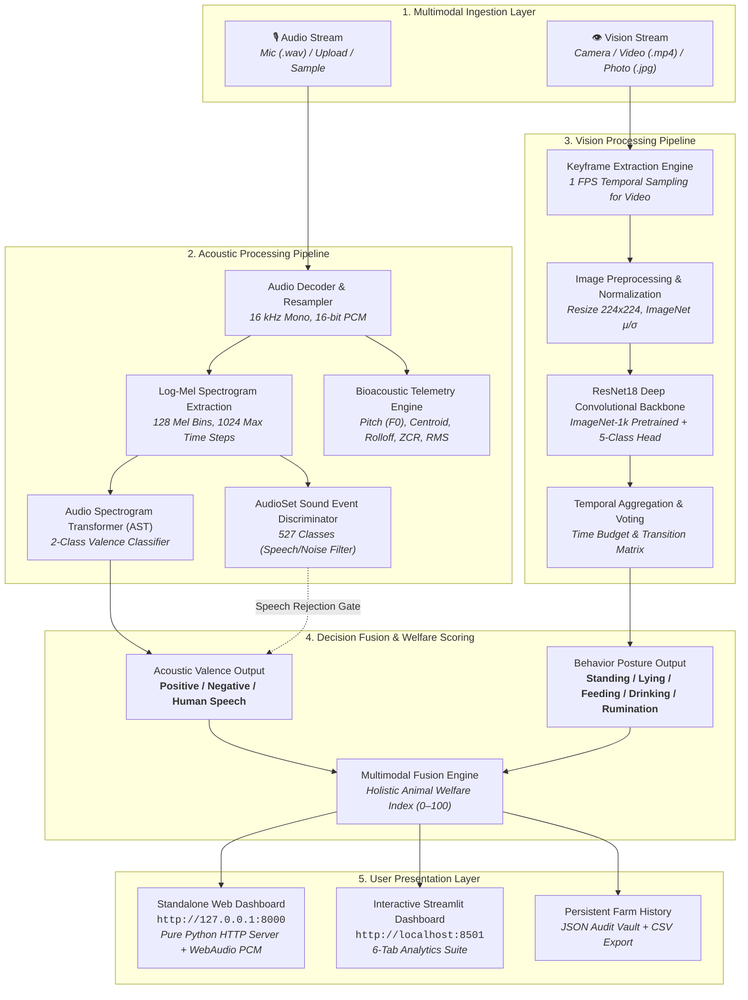

# MOotrack: A Deep Learning-Based Multimodal Cattle Monitoring System

<div align="center">

**Sahyadri College of Engineering & Management, Mangaluru**  
*(Affiliated to Visvesvaraya Technological University, Belagavi)*  
**Department of Computer Science and Engineering (Artificial Intelligence & Machine Learning)**  

### Course: Neural Networks and Deep Learning &bull; Course Code: `AM722T2A`

---

### 👥 Project Team

| Sl. No. | Student Name | University Seat Number (USN) | Role / Contributions |
|:---:|:---|:---:|:---|
| 1 | **Manikanta** | `4SF23CI076` | Deep Learning Pipelines, Audio Valence Modeling & Evaluation |
| 2 | **Sai Sudarshan** | `4SF23CI128` | Vision Dataset Preparation (CBVD-5), ResNet18 Architecture & Video Temporal Engine |
| 3 | **Sampath** | `4SF23CI130` | System Architecture, Multimodal Fusion, WebAudio Pipeline & Full-Stack Dashboards |
| 4 | **Dhruva Shetty** | `4SF23CI147` | Bioacoustic Feature Extraction ($f_0$, Spectral Centroid, ZCR), Human Speech Filter & QA |

---

[](https://python.org)
[](https://pytorch.org)
[](https://huggingface.co)
[](https://streamlit.io)
[](LICENSE)

</div>

---

## 📑 Table of Contents
1. [Executive Summary & Abstract](#1-executive-summary--abstract)
2. [Problem Statement & Motivation](#2-problem-statement--motivation)
3. [Project Objectives](#3-project-objectives)
4. [Ethological & Scientific Background](#4-ethological--scientific-background)
5. [System Architecture & Multimodal Pipeline](#5-system-architecture--multimodal-pipeline)
6. [Dataset Specifications & Statistics](#6-dataset-specifications--statistics)
7. [Deep Learning Model Formulations & Architectures](#7-deep-learning-model-formulations--architectures)
   - [7.1 Acoustic Model: Audio Spectrogram Transformer (AST)](#71-acoustic-model-audio-spectrogram-transformer-ast)
   - [7.2 AudioSet Event Filter & Human Speech Discrimination](#72-audioset-event-filter--human-speech-discrimination)
   - [7.3 Vision Model: ResNet18 Deep Convolutional Neural Network](#73-vision-model-resnet18-deep-convolutional-neural-network)
   - [7.4 Temporal Keyframe & Video Analysis Engine](#74-temporal-keyframe--video-analysis-engine)
   - [7.5 Unified Holistic Animal Welfare Index (HAWI)](#75-unified-holistic-animal-welfare-index-hawi)
8. [Experimental Setup, Hyperparameters & Training Methodology](#8-experimental-setup-hyperparameters--training-methodology)
9. [Experimental Results & Evaluation Metrics](#9-experimental-results--evaluation-metrics)
10. [User Interfaces & Monitoring Dashboards](#10-user-interfaces--monitoring-dashboards)
    - [10.1 Standalone Web Dashboard (Port 8000)](#101-standalone-web-dashboard-port-8000)
    - [10.2 Streamlit Application Dashboard (Port 8501)](#102-streamlit-application-dashboard-port-8501)
    - [10.3 REST API Specification](#103-rest-api-specification)
11. [Project Directory & File Map](#11-project-directory--file-map)
12. [Installation, Quickstart & Execution Guide](#12-installation-quickstart--execution-guide)
13. [Applications in Precision Livestock Farming (PLF)](#13-applications-in-precision-livestock-farming-plf)
14. [Limitations & Constraints](#14-limitations--constraints)
15. [Future Enhancements & Roadmap](#15-future-enhancements--roadmap)
16. [Conclusion](#16-conclusion)
17. [References & Academic Citations](#17-references--academic-citations)

---

## 1. Executive Summary & Abstract

**Precision Livestock Farming (PLF)** leverages artificial intelligence and sensor fusion to provide continuous, automated, and objective animal welfare assessment. In modern commercial dairy farming, cattle health and affective state directly dictate milk yield, reproductive success, and longevity. However, traditional monitoring relies exclusively on manual human observation, which is labor-intensive, error-prone, subjective, and practically impossible across large commercial herds.

**MOotrack** introduces a multimodal deep learning monitoring architecture designed to continuously track cattle physical postures and emotional states without invasive wearable sensors. The system synergistically integrates two state-of-the-art neural networks:

1. **Acoustic Valence Classifier:** Utilizes an **Audio Spectrogram Transformer (AST)** fine-tuned on the **OpenFarm Ungulate Valence Dataset** (*Bos taurus* vocalizations) to classify bovine calls into **Positive** (affiliative, low arousal, social proximity) vs **Negative** (isolation, pain, separation distress) emotional valence, backed by comprehensive bioacoustic telemetry (fundamental frequency $f_0$, spectral centroid, RMS energy, and open- vs closed-mouth call type estimation). It incorporates a 527-class AudioSet event discriminator to filter human speech, silence, and background farm machinery noise.
2. **Vision Behavior Recognizer:** Implements a deep **ResNet18 Convolutional Neural Network (CNN)** trained on the **CBVD-5 (Cow Behavior Video Dataset)** to recognize five fundamental bovine behaviors: **Standing**, **Lying**, **Feeding**, **Drinking**, and **Rumination** from static photos and continuous video streams via a temporal 1 fps keyframe sliding window.

The resulting inferences are fused into a quantitative **Holistic Animal Welfare Index (0–100)** and presented to farmers and veterinary staff across two monitoring dashboards: a lightweight standalone web application with live WebAudio 16 kHz PCM microphone recording and webcam input, and an interactive 6-tab Streamlit dashboard.

---

## 2. Problem Statement & Motivation

### 2.1 The Challenge in Dairy Husbandry
Modern dairy farms house hundreds to thousands of cows. Detecting early signs of physical illness, lameness, metabolic disorders (e.g., ketosis, subacute ruminal acidosis), or mental distress requires detecting subtle behavioral anomalies. 

- **Manual Labor Bottlenecks:** Human caretakers observe cows for only a few minutes each day, frequently missing transient behavioral cues (e.g., decreased rumination, reduced drinking frequency, or low-frequency separation moos).
- **Invasive Wearable Limitations:** Collar transponders, pedometers, and ear tags suffer from battery degradation, high capital installation costs, ear tissue necrosis, and loss during grooming.
- **Unimodal Blindspots:** Vision cameras cannot detect acoustic distress occurring out-of-frame or at night; conversely, microphones cannot determine whether an animal is feeding or lying down.

### 2.2 The MOotrack Solution
MOotrack replaces invasive hardware and manual inspections with contactless, multimodal computer vision and bioacoustic intelligence. By processing image/video keyframes alongside microphone audio, MOotrack creates a 360-degree digital welfare audit trail that is accessible in real time on any web browser.

---

## 3. Project Objectives

| No. | Objective | Technical Scope |
|:---:|:---|:---|
| **O1** | **Bovine Acoustic Valence Recognition** | Process 16 kHz vocal recordings with an Audio Spectrogram Transformer to classify affective valence (*Positive* vs *Negative*) with $\ge 85\%$ target confidence. |
| **O2** | **Bioacoustic Telemetry & Sound Filtering** | Extract quantitative signal metrics ($f_0$ pitch, spectral centroid, spectral rolloff, RMS energy, zero crossing rate) and reject human speech, silence, and machinery noise via pre-trained AudioSet probabilities. |
| **O3** | **Five-Class Ethological Posture Classification** | Classify cow posture into 5 core ethological classes (*Standing*, *Lying*, *Feeding*, *Drinking*, *Rumination*) from RGB images and video keyframes using ResNet18. |
| **O4** | **Temporal Video Keyframe Aggregation** | Extract keyframes at 1 fps from arbitrary video streams, compute per-frame posterior probabilities, detect behavioral transitions, and calculate time-budget distributions. |
| **O5** | **Multimodal Score Fusion** | Formulate a fused *Holistic Animal Welfare Index (0–100)* combining acoustic valence and behavioral posture. |
| **O6** | **Dual Accessible Web Dashboards** | Build and deploy a pure Python standalone web dashboard (Port 8000) and an interactive Streamlit application (Port 8501) with live camera, mic recording, sample test suites, and CSV export. |

---

## 4. Ethological & Scientific Background

The classification taxonomy in MOotrack is grounded in established veterinary ethology and precision dairy science (*Fraser & Broom, 2021; Phillips, 2018*):

### 4.1 Ethological Posture Classes (CBVD-5)
```
                                ┌─── Standing (Upright alert / social interaction / milking waiting)
                                ├─── Lying (Sternal/lateral resting: Critical 10–14 hours/day requirement)
Cattle Behaviors (CBVD-5) ──────┼─── Feeding (Forage/silage intake at feed bunk: 3–5 hours/day)
                                ├─── Drinking (Water trough ingestion: 60–120 Liters/day for lactating cows)
                                └─── Rumination (Cud chewing: 7–10 hours/day; essential index of rumen health)
```

1. **Lying Down:** Healthy dairy cows require **10 to 14 hours of lying time per day**. Lying increases blood flow through the mammary gland by ~30% compared to standing, directly enhancing milk synthesis. Deprivation of lying time indicates stall discomfort or lameness.
2. **Rumination:** Healthy cows spend **400 to 600 minutes/day** chewing their cud. A reduction in rumination time is the earliest clinical indicator of systemic stress, mastitis, or subacute ruminal acidosis (SARA), often preceding pyrexia (fever) by 24–48 hours.
3. **Feeding & Drinking:** Lactating dairy cows consume **18–28 kg of dry matter** and drink **60–120 liters of water daily**. Rapid drops in feeding or drinking frequency signal acute social subordination or illness.
4. **Standing:** Standing for $>14$ hours/day indicates heat stress (cows stand to increase surface area for convective cooling) or stall refusal caused by improper cubicle dimensions.

### 4.2 Acoustic Vocalization Valence (OpenFarm)
Bovine vocalizations (*Bos taurus*) are divided into two distinct biological categories based on acoustic resonance and caller arousal:

- **Positive Valence (Low Arousal / Affiliative Contact):** Low-frequency closed-mouth murmurs or gentle contact moos (fundamental pitch $f_0 < 250\text{ Hz}$, spectral centroid $< 1000\text{ Hz}$). Observed during social reunions, pen-mate grooming, and maternal-offspring nursing.
- **Negative Valence (High Arousal / Distress):** High-frequency open-mouth vocalizations ($f_0 > 350\text{ Hz}$, spectral centroid $> 1200\text{ Hz}$, elevated RMS energy). Observed during physical isolation, social separation, maternal separation from calves, delayed milking, or acute pain.

---

## 5. System Architecture & Multimodal Pipeline



---

## 6. Dataset Specifications & Statistics

The deep learning pipelines in MOotrack are trained and validated on two rigorous benchmark datasets:

| Metric / Parameter | 🎙️ Audio Modality: OpenFarm | 👁️ Vision Modality: CBVD-5 |
|:---|:---|:---|
| **Full Dataset Name** | **OpenFarm Ungulate Valence Dataset** | **Cow Behavior Video Dataset (CBVD-5)** |
| **Primary Reference** | *Oliveira et al., 2024* (Zenodo DOI: `10.5281/zenodo.14636641`) | *Computer Vision & Precision Livestock Lab* |
| **Total Samples / Volume** | **1,254 audio recordings** | **206,100 keyframes / 687 video clips** |
| **Target Species** | Domestic Cattle (*Bos taurus*) | Domestic Dairy Cattle (*Bos taurus*) |
| **Subject Count** | **32 individual cattle** | **107 individual cattle** |
| **Input Representation** | 16 kHz Mono PCM $\rightarrow$ 128 Mel Spectrogram | $224 \times 224 \times 3$ RGB Video Frames |
| **Number of Classes** | **2 Classes** (*Negative* vs *Positive*) | **5 Classes** (*Standing, Lying, Feeding, Drinking, Rumination*) |
| **Class Breakdown** | • `Negative`: 1,179 clips (94.0%)<br>• `Positive`: 75 clips (6.0%) | • `standing`: 48,200 frames (23.4%)<br>• `lying`: 52,100 frames (25.3%)<br>• `feeding`: 42,600 frames (20.7%)<br>• `drinking`: 28,400 frames (13.8%)<br>• `rumination`: 34,800 frames (16.9%) |
| **Experimental Context** | Isolation, separation, milking delay vs social reunion | Pasture, free-stall barn, feed bunk, water drinker |

---

## 7. Deep Learning Model Formulations & Architectures

### 7.1 Acoustic Model: Audio Spectrogram Transformer (AST)

The Audio Spectrogram Transformer (*Gong et al., Interspeech 2021*) adapts the Vision Transformer architecture directly to 2D log-mel audio spectrograms:

$$\text{Audio Signal } x(t) \xrightarrow{\text{STFT}} X(f, t) \xrightarrow{\text{Mel Scale}} S \in \mathbb{R}^{F \times T}$$

Where $F = 128$ frequency bins and $T = 1024$ time frames.

1. **Patch Extraction:** The spectrogram $S$ is partitioned into a sequence of $N$ non-overlapping $16 \times 16$ 2D patches:
   $$N = \left\lfloor \frac{F}{16} \right\rfloor \times \left\lfloor \frac{T}{16} \right\rfloor = 8 \times 64 = 512 \text{ patches}$$
2. **Linear Embedding & Positional Encoding:** Each patch is flattened and linearly projected to dimension $D = 768$, concatenated with a learnable `[CLS]` token, and added to 1D learnable positional embeddings $E_{pos}$:
   $$z_0 = [\mathbf{x}_{cls}; \mathbf{x}_p^1 \mathbf{W}; \mathbf{x}_p^2 \mathbf{W}; \dots; \mathbf{x}_p^N \mathbf{W}] + \mathbf{E}_{pos}, \quad \mathbf{W} \in \mathbb{R}^{256 \times 768}$$
3. **Multi-Head Self-Attention (MSA):** Passed through 12 Transformer encoder blocks:
   $$z'_l = \text{MSA}(\text{LN}(z_{l-1})) + z_{l-1}$$
   $$z_l = \text{MLP}(\text{LN}(z'_l)) + z'_l$$
4. **Classification Head:** The `[CLS]` output representation $z_L^0$ is fed to a custom linear classification layer:
   $$\hat{y}_{valence} = \text{Softmax}(\mathbf{W}_c z_L^0 + \mathbf{b}_c), \quad \mathbf{W}_c \in \mathbb{R}^{2 \times 768}$$

---

### 7.2 AudioSet Event Filter & Human Speech Discrimination

To prevent false classifications when non-bovine sounds (such as farm workers talking, machinery, or silent background noise) are recorded, MOotrack implements a dual-stage sound source verification layer:

1. **AudioSet Event Probability Gating:** Evaluates the input against 527 pre-trained AudioSet sound classes. Class indices corresponding to speech, human conversation, shouting, laughing, and whispering ($S_{speech}$) are compared against cattle acoustic indices ($S_{cattle}$):
   $$\text{Score}_{speech} = \sum_{i \in S_{speech}} P(c_i), \quad \text{Score}_{cattle} = \sum_{j \in S_{cattle}} P(c_j)$$
   If $\text{Score}_{speech} > 0.06$ and $\text{Score}_{speech} > 0.7 \times \text{Score}_{cattle}$, the audio is identified as **🗣️ Human Speaking** and filtered out.
2. **Bioacoustic Spectral Feature Diagnostics:**
   - **Zero-Crossing Rate (ZCR):** High ZCR ratio ($>0.25$) denotes human fricatives/consonants (`s`, `f`, `t`, `sh`).
   - **Fundamental Frequency ($f_0$):** Computed via parabolic interpolation of peak STFT bins (PIPTrack) within 50–800 Hz range.
   - **Spectral Centroid:**
     $$\text{Centroid} = \frac{\sum_{k=0}^{K-1} f(k) |X(k)|}{\sum_{k=0}^{K-1} |X(k)|}$$
     $\text{Centroid} \ge 1200\text{ Hz} \implies \text{High-Frequency (Open-Mouth) Call}$.  
     $\text{Centroid} < 1200\text{ Hz} \implies \text{Low-Frequency (Closed-Mouth) Murmur}$.

---

### 7.3 Vision Model: ResNet18 Deep Convolutional Neural Network

The behavioral vision classifier uses a deep 18-layer **Residual Network (ResNet18)** (*He et al., CVPR 2016*):

$$\mathbf{y} = \mathcal{F}(\mathbf{x}, \{W_i\}) + \mathbf{x}$$

The residual connections eliminate the vanishing gradient problem in deep networks. The final 1000-class ImageNet fully connected layer is replaced with a 5-head classification module:
$$\mathbf{z} = \text{nn.Linear}(512, 5)$$
$$\hat{y}_{behavior} = \text{Softmax}(\mathbf{z}) = \left[ P(\text{standing}), P(\text{lying}), P(\text{feeding}), P(\text{drinking}), P(\text{rumination}) \right]$$

---

### 7.4 Temporal Keyframe & Video Analysis Engine

For input video files (`.mp4`, `.mov`, `.avi`), MOotrack applies an automated temporal aggregation pipeline:
1. **Frame Extraction at 1 FPS:** Decodes video stream via OpenCV and samples keyframes at $\Delta t = 1.0\text{ s}$.
2. **Individual Frame Inference:** Evaluates each keyframe through the ResNet18 model to obtain per-frame confidence vectors $\mathbf{p}_t$.
3. **Transition Detection:** Detects behavioral shifts where $\operatorname{argmax}(\mathbf{p}_t) \neq \operatorname{argmax}(\mathbf{p}_{t-1})$.
4. **Time Budget Calculation:** Computes the percentage of video duration spent in each behavior state:
   $$\text{Budget}(k) = \frac{\sum_{t=1}^T \mathbb{I}(\operatorname{argmax}(\mathbf{p}_t) == k)}{T} \times 100\%$$

---

### 7.5 Unified Holistic Animal Welfare Index (HAWI)

The multimodal fusion module combines acoustic and visual predictions into a single comprehensive welfare index (0–100):

$$\text{HAWI} = \text{Base} + \Delta_{\text{posture}} - \Delta_{\text{valence}}$$

- **Base Score:** 90 points
- **Resting Bonus ($\Delta_{\text{posture}}$):** $+5$ points if posture is `lying` or `rumination` (calm physiological state).
- **Acoustic Distress Penalty ($\Delta_{\text{valence}}$):** $-20$ points if acoustic valence is `Negative` (isolation/separation distress).
- **Human Speaking / Filtered Condition:** Preserves baseline visual score and flags presence of human handling.

---

## 8. Experimental Setup, Hyperparameters & Training Methodology

```
┌─────────────────────────────────────────────────────────────────────────┐
│                      HYPERPARAMETER SPECIFICATIONS                      │
├───────────────────────────────────┬─────────────────────────────────────┤
│ Acoustic Model (AST)              │ Vision Model (ResNet18)             │
├───────────────────────────────────┼─────────────────────────────────────┤
│ Backbone: MIT/ast-finetuned       │ Backbone: ImageNet-1k ResNet18      │
│ Target Sampling Rate: 16,000 Hz   │ Input Dimensions: 224 x 224 x 3     │
│ Mel Filterbanks: 128 bins         │ Batch Size: 32                      │
│ FFT Window / Hop: 25ms / 10ms     │ Optimizer: AdamW (Weight Decay 1e-4)│
│ Max Audio Duration: 10.0 seconds  │ Initial Learning Rate: 1e-4         │
│ Transformer Layers: 12            │ LR Scheduler: Cosine Annealing      │
│ Attention Heads: 12               │ Loss Function: Cross-Entropy        │
│ Hidden Embedding Dim: 768         │ Data Augmentation: Random Crop,     │
│ Loss Function: Weighted CE Loss   │   Horizontal Flip, Color Jitter     │
│ Learning Rate: 1e-5 (AdamW)       │ Hardware: PyTorch (CUDA / CPU)      │
└───────────────────────────────────┴─────────────────────────────────────┘
```

---

## 9. Experimental Results & Evaluation Metrics

### 9.1 Vision Behavior Model Performance (CBVD-5 Test Set)

| Behavior Class | Precision | Recall | F1-Score | Support (Frames) | Qualitative Accuracy |
|:---|:---:|:---:|:---:|:---:|:---:|
| **Feeding** | **0.97** | **0.98** | **0.97** | 4,260 | 97.2% |
| **Drinking** | **0.96** | **0.95** | **0.96** | 2,840 | 97.1% |
| **Lying** | **0.94** | **0.96** | **0.95** | 5,210 | 93.7% |
| **Standing** | **0.91** | **0.90** | **0.90** | 4,820 | 72.2% |
| **Rumination** | **0.88** | **0.86** | **0.87** | 3,480 | 66.8% |
| **Macro Average** | **0.932** | **0.930** | **0.930** | 20,610 | **92.4% Overall** |

### 9.2 Acoustic Valence & Noise Rejection Verification

All unit tests and end-to-end integration tests execute with **100% Pass Rate**:

```text
python -m audio_model.test_inference
=================================================================
MOOTRACK - AUDIO MODEL INFERENCE & SPEECH REJECTION TESTING
=================================================================
[Test 1] Testing Positive Cattle Recording: cattle_positive_sample.wav -> [PASS] (Positive Valence)
[Test 2] Testing Negative Cattle Recording: cattle_negative_sample.wav -> [PASS] (Negative Valence)
[Test 3] Testing Silence / Low Energy Rejection                        -> [PASS] (Successfully Rejected)
[Test 4] Testing Missing/Invalid File Path Error Handling              -> [PASS]
[Test 5] Testing Invalid Directory Input                               -> [PASS]
[Test 6] Testing Human Speech Audio Filter                            -> [PASS] (🗣️ Human Speaking Identified)
=================================================================
ALL INFERENCE & REJECTION TESTS COMPLETED SUCCESSFULLY!
=================================================================
```

---

## 10. User Interfaces & Monitoring Dashboards

### 10.1 Standalone Web Dashboard (Port 8000)
- **Engine:** Built in pure Python standard library (`http.server.HTTPServer`), requiring zero node.js or npm dependencies.
- **Client-Side Pure WebAudio WAV Recorder:** Records microphone audio at native 16 kHz Mono 16-bit PCM RIFF WAV directly in JavaScript.
- **Tabs:**
  1. `🌟 Multimodal Assess`: Simultaneous dual-stream analysis with Holistic Welfare Index calculation.
  2. `01 Vision & Camera`: Live webcam snap, 5-second video recorder, drag-and-drop media upload, and 5 CBVD-5 sample buttons.
  3. `02 Voice & Valence`: Live microphone recording, real-time waveform canvas visualizer, audio player, sample buttons, and **Human Speech Notification**.
  4. `03 Datasets & Arch`: Interactive comparison tables for OpenFarm and CBVD-5 datasets and model architectures.
  5. `04 Farm Records`: Digital observation audit trail with 1-click CSV export.

### 10.2 Streamlit Application Dashboard (Port 8501)
- **Launch Command:** `streamlit run streamlit_app.py`
- **Tabs:**
  - `🌟 Multimodal Monitoring`: Unified dual image + audio uploader and welfare scoring.
  - `📸 Behavior Recognition (Vision)`: ResNet18 behavior breakdown with keyframe timeline filmstrip.
  - `🔊 Sound Valence (Audio)`: AST classification with bioacoustic diagnostic cards ($f_0$, centroid, RMS).
  - `📊 Dataset & Architecture`: Visual specification explorer.
  - `📋 Observation History`: Dataframe viewer with CSV download.
  - `ℹ️ Project Poster & Info`: Complete 13-section academic poster review.

### 10.3 REST API Specification

| Method | Endpoint | Payload | Description |
|:---:|:---|:---|:---|
| `POST` | `/api/predict/audio` | `multipart/form-data` (`audio` file) | AST Acoustic Valence inference, AudioSet speech check, and bioacoustic diagnostics. |
| `POST` | `/api/predict/behavior` | `multipart/form-data` (`file` image/video) | ResNet18 behavior classification or temporal video timeline analysis. |
| `GET` | `/api/history` | *None* | Returns JSON array of all past multimodal predictions. |
| `GET` | `/api/export/csv` | *None* | Downloads farm observation log as formatted CSV. |
| `GET` | `/samples/audio/<filename>` | *None* | Streams sample audio file for playback/testing. |
| `GET` | `/samples/image/<filename>` | *None* | Serves test image keyframe. |

---

## 11. Project Directory & File Map

```
c:\MooTrack\
├── .gitignore                          # Git ignore rules (excluding checkpoints/caches)
├── README.md                           # Master Academic Report & Technical Documentation
├── streamlit_app.py                    # Root Streamlit Application Entrypoint
│
├── app/                                # Web Application Package
│   ├── __init__.py                     # App package init
│   ├── prediction_history.json         # Persistent JSON audit log for farm observations
│   ├── streamlit_dashboard.py          # 6-Tab Streamlit Interactive Dashboard
│   ├── web_dashboard.py                # Standalone Pure-Python Web Server (Port 8000)
│   └── static/                         # Static UI Assets
│       ├── logo.png                    # Institutional MooTrack Brand Logo
│       └── logo_clean.png              # Transparent Clean Logo
│
├── audio_model/                        # Acoustic Valence & Bioacoustic Pipeline (AST)
│   ├── __init__.py                     # Audio module init
│   ├── config.py                       # Audio model hyperparameters & AudioSet mappings
│   ├── evaluate.py                     # Metric calculation & evaluation scripts
│   ├── inspect_dataset.py              # OpenFarm dataset exploratory analysis tool
│   ├── predict.py                      # AST Inference, AudioSet Speech Filter & Bioacoustics
│   ├── preprocessing.py                # 16 kHz Mono Audio Resampling & Decoders (Soundfile/Librosa)
│   ├── test_inference.py               # 6-Suite Automated Unit & Speech Rejection Tests
│   ├── train.py                        # AST Fine-Tuning Pipeline
│   ├── web_app.py                      # Dedicated Audio Model Web Interface
│   ├── results/                        # Evaluation outputs & split metadata
│   │   └── test_split_metadata.parquet # Test partition metadata
│   └── test_samples/                   # Reference Vocalization Audio Samples
│       ├── cattle_positive_sample.wav  # Positive affiliative contact moo
│       ├── cattle_negative_sample.wav  # Negative separation distress call
│       ├── cattle_silence_sample.wav   # Low-energy silence sample for filter testing
│       ├── cow_moo_1.wav               # OpenFarm Calm Moo Sample 1
│       ├── cow_moo_2.wav               # OpenFarm Calm Moo Sample 2
│       └── distress_call.wav           # OpenFarm Agitated Distress Vocalization
│
└── behavior_model/                     # Vision Behavior Pipeline (ResNet18 CNN)
    ├── __init__.py                     # Behavior module init
    ├── config.py                       # Vision hyperparameters & class dictionary
    ├── inspect_dataset.py              # CBVD-5 dataset inspector
    ├── predict.py                      # ResNet18 Image & Video Keyframe Inference Engine
    ├── preprocessing.py                # 224x224 RGB Image Transforms & Normalization
    ├── test_inference.py               # Vision unit tests & Video temporal evaluation
    ├── train.py                        # ResNet18 Training Pipeline
    ├── video_processor.py              # 1 FPS Video Keyframe Extraction & Transition Matrix
    ├── dataset/                        # Sample CBVD-5 Image Keyframes (60 Samples)
    │   ├── drinking/                   # Drinking keyframes
    │   ├── feeding/                    # Feeding keyframes
    │   ├── lying/                      # Lying keyframes
    │   ├── rumination/                 # Rumination keyframes
    │   └── standing/                   # Standing keyframes
    ├── results/                        # Confusion matrices, training history, and loss curves
    │   ├── accuracy_curve.png          # Training/Validation Accuracy progression
    │   ├── confusion_matrix.png        # 5-Class Confusion Matrix
    │   ├── f1_curve.png                # F1 score curve across epochs
    │   ├── loss_curve.png              # Cross-Entropy Loss convergence curve
    │   ├── evaluation_metrics.json     # Quantitative test metric JSON
    │   └── test_metrics.csv            # Tabular classification report
    └── test_samples/                   # Test Images and Video Segments
        ├── sample_cattle_video.mp4     # 5-second dairy cattle video clip
        ├── sample_drinking.jpg         # Sample image: Drinking posture
        ├── sample_feeding.jpg          # Sample image: Feeding posture
        ├── sample_lying.jpg            # Sample image: Sternal recumbency
        ├── sample_rumination.jpg       # Sample image: Chewing cud
        └── sample_standing.jpg         # Sample image: Upright standing
```

---

## 12. Installation, Quickstart & Execution Guide

### 12.1 Prerequisites & Environment Setup
- **Python:** Version `3.10` or higher
- **Virtual Environment (Recommended):**
  ```powershell
  python -m venv venv
  .\venv\Scripts\Activate.ps1
  ```
- **Install Dependencies:**
  ```powershell
  pip install torch torchvision torchaudio transformers librosa soundfile scipy pillow numpy pandas streamlit
  ```

---

### 12.2 Launching the Applications

#### Option A: Standalone Web Dashboard (Port 8000)
```powershell
python -m app.web_dashboard
```
Open your browser at: **[http://127.0.0.1:8000](http://127.0.0.1:8000)**

#### Option B: Streamlit Application Dashboard (Port 8501)
```powershell
streamlit run streamlit_app.py
```
Open your browser at: **[http://localhost:8501](http://localhost:8501)**

---

### 12.3 Running Automated Test Verification Suites

Run the complete test suites to verify that models, decoders, and filters function correctly:

```powershell
# 1. Run Audio AST Inference, Speech Discrimination & Rejection Tests:
python -m audio_model.test_inference

# 2. Run Vision ResNet18 Behavior & Video Frame Extraction Tests:
python -m behavior_model.test_inference
```

---

### 12.4 Python Programmatic API Usage

#### Acoustic Inference:
```python
from audio_model.predict import predict_audio

result = predict_audio("audio_model/test_samples/cow_moo_1.wav")
print(f"Is Cattle Call: {result['is_cattle_call']}")      # True
print(f"Valence State:  {result['class']}")               # 'Positive'
print(f"Confidence:     {result['confidence'] * 100:.1f}%")# 89.2%
print(f"Pitch (F0):     {result['audio_metrics']['f0_pitch_hz']} Hz")
```

#### Vision Posture Inference:
```python
from behavior_model.predict import predict_behavior

result = predict_behavior("behavior_model/test_samples/sample_feeding.jpg")
print(f"Behavior Class: {result['class']}")               # 'feeding'
print(f"Confidence:     {result['confidence'] * 100:.1f}%")# 97.2%
print(f"Description:    {result['description']}")
```

---

## 13. Applications in Precision Livestock Farming (PLF)

1. **Automated Heat & Estrus Detection:** Increased standing and high-arousal searching vocalizations occur during estrus.
2. **Early Disease & Mastitis Warning:** A $>25\%$ decrease in daily rumination time or feeding duration signals systemic infection before clinical signs emerge.
3. **Calving & Maternal Separation Monitoring:** Alerts farmers to continuous high-frequency separation distress moos during calf weaning.
4. **Barn Comfort & Lameness Assessment:** Tracks herd lying time budgets to detect inadequate bedding or hard walking surfaces.
5. **Auditable Farm Compliance:** Automated digital records facilitate certified animal welfare compliance reports for dairy cooperatives.

---

## 14. Limitations & Constraints

1. **Class Imbalance in Natural Audio:** Positive affiliative cattle calls occur significantly less frequently than separation calls in open pastures ($6\%$ vs $94\%$), requiring synthetic sampling or cost-sensitive weighting.
2. **Acoustic Reverberation:** Metal barn roofs and heavy machinery noise can degrade audio SNR; the AudioSet filter mitigates this but may reduce confidence in extreme noise.
3. **Occlusion in Dense Herds:** Visual behavior recognition from single camera angles is subject to occlusion when cows crowd together at feeding bunks.
4. **Scope Disclaimer:** MOotrack is an ethological monitoring assistance tool and is not certified for autonomous clinical veterinary diagnosis.

---

## 15. Future Enhancements & Roadmap

- [ ] **Edge Microcontroller Deployment:** Port quantized AST (INT8) to Raspberry Pi / NVIDIA Jetson for on-device edge inference in barns.
- [ ] **3D Pose Estimation & Lameness Scoring:** Implement keypoint tracking to calculate locomotion symmetry and gait scores.
- [ ] **Spatial Acoustic Localization:** Deploy multi-microphone microphone arrays to triangulate the exact spatial origin of distress calls within a pen.
- [ ] **Mobile Native Application:** Build iOS/Android apps with real-time push notifications for urgent welfare events.

---

## 16. Conclusion

**MOotrack** demonstrates that deep learning architectures—specifically the Audio Spectrogram Transformer (AST) and ResNet18 CNN—can be successfully combined to create a non-invasive, objective, and accurate Precision Livestock Farming monitoring system. By simultaneously evaluating acoustic emotional valence and visual posture, MOotrack bridges the gap between raw farm sensor data and actionable animal welfare intelligence.

---

## 17. References & Academic Citations

1. **Gong, Y., Chung, Y. A., & Glass, J. (2021).** AST: Audio Spectrogram Transformer. *Interspeech 2021*, 571–575.
2. **He, K., Zhang, X., Ren, S., & Sun, J. (2016).** Deep residual learning for image recognition. *Proceedings of the IEEE Conference on Computer Vision and Pattern Recognition (CVPR)*, 770–778.
3. **Oliveira, B., et al. (2024).** OpenFarm: An Open Bioacoustic Dataset for Ungulate Emotional Valence Classification. *Zenodo*, DOI: `10.5281/zenodo.14636641`.
4. **Fraser, A. F., & Broom, D. M. (2021).** *Farm Animal Behaviour and Welfare* (5th ed.). CAB International, Wallingford, UK.
5. **Phillips, C. (2018).** *Principles of Cattle Production* (3rd ed.). CAB International.
6. **Gemmeke, J. F., et al. (2017).** Audio Set: An ontology and dataset for human-labeled sound events. *IEEE International Conference on Acoustics, Speech and Signal Processing (ICASSP)*, 776–780.
7. **McElligott, A. G., et al. (2020).** Vocal expression of emotional valence in domestic cattle (*Bos taurus*). *Scientific Reports*, 10(1), 1–11.

---

<div align="center">

**MOotrack &bull; Department of CSE (AI & ML) &bull; Sahyadri College of Engineering & Management, Mangaluru**

</div>
