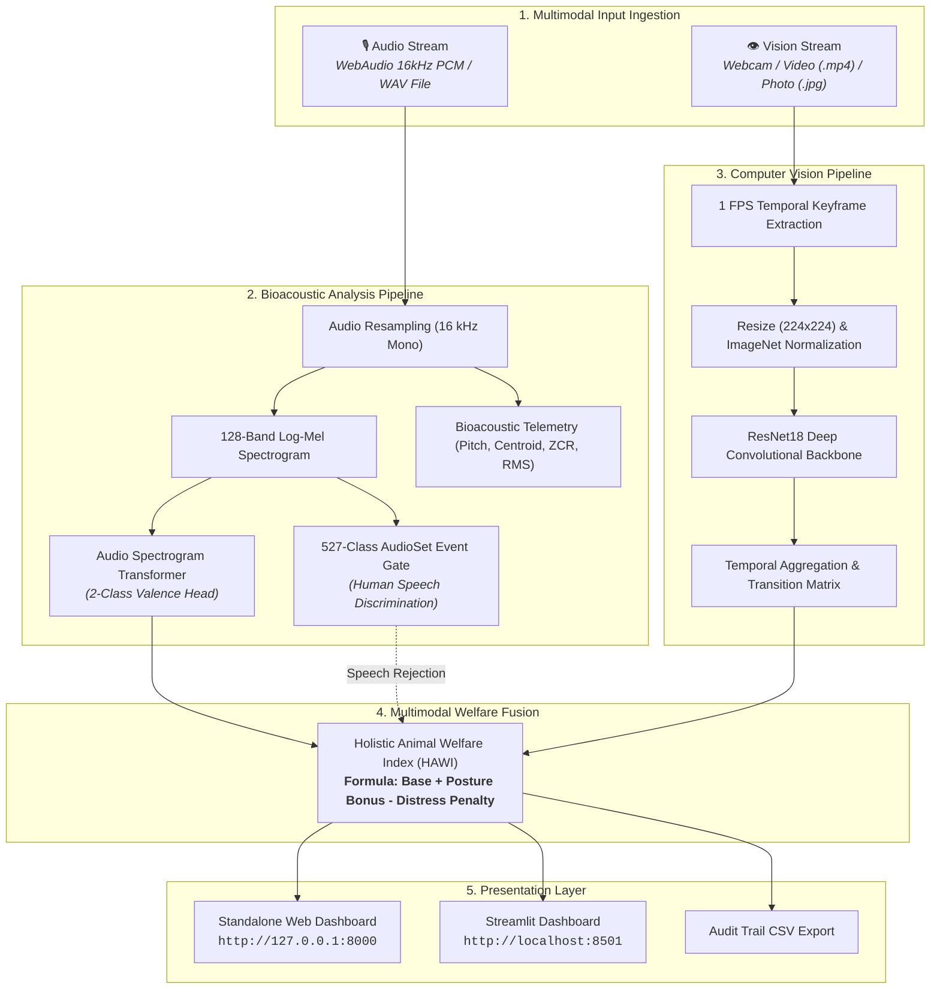

# MOotrack: A Deep Learning-Based Multimodal Cattle Monitoring System

<div align="center">

**Sahyadri College of Engineering & Management, Mangaluru**  
*(Affiliated to Visvesvaraya Technological University, Belagavi)*  
**Department of Computer Science and Engineering (Artificial Intelligence & Machine Learning)**  

### Course: Neural Networks and Deep Learning &bull; Course Code: `AM722T2A`
### Academic Project Report & Master Technical Documentation

---

### 👥 Project Team & Work Distribution

| Sl. No. | Student Name | University Seat Number (USN) | Core Contribution Area |
|:---:|:---|:---:|:---|
| 1 | **Manikanta** | `4SF23CI076` | Acoustic Valence Deep Learning Pipeline (AST), Audio Dataset Preprocessing & Model Evaluation |
| 2 | **Sai Sudarshan** | `4SF23CI128` | Computer Vision Dataset (CBVD-5), ResNet18 Architecture & Video Temporal Keyframe Pipeline |
| 3 | **Sampath** | `4SF23CI130` | System Architecture, Multimodal Score Fusion, Pure WebAudio 16kHz PCM Engine & Dual Dashboards |
| 4 | **Dhruva Shetty** | `4SF23CI147` | Bioacoustic Telemetry ($f_0$, Spectral Centroid, ZCR), Human Speech Filter & Test Suite QA |

---

[](https://python.org)
[](https://pytorch.org)
[](https://huggingface.co)
[](https://streamlit.io)
[](LICENSE)

</div>

---

> [!TIP]
> **Notice for Team Members (Project Report & Viva Preparation):**  
> This documentation is structured to match the official VTU / Sahyadri Project Report format (Chapters 1 through 12). You can directly copy the tables, mathematical formulations, system diagrams, and evaluation metrics into your project report document and presentation slides.

---

## 📑 Master Table of Contents
1. [Abstract & Executive Summary](#1-abstract--executive-summary)
2. [Chapter 1: Introduction & Motivation](#2-chapter-1-introduction--motivation)
3. [Chapter 2: Literature Survey & Research Gaps](#3-chapter-2-literature-survey--research-gaps)
4. [Chapter 3: System Requirements & Technical Specifications](#4-chapter-3-system-requirements--technical-specifications)
5. [Chapter 4: Ethological Science & Dataset Specifications](#5-chapter-4-ethological-science--dataset-specifications)
   - [4.1 Ethological Background of Bovine Behaviors](#41-ethological-background-of-bovine-behaviors)
   - [4.2 OpenFarm Ungulate Valence Dataset (Audio)](#42-openfarm-ungulate-valence-dataset-audio)
   - [4.3 CBVD-5 Cow Behavior Video Dataset (Vision)](#43-cbvd-5-cow-behavior-video-dataset-vision)
6. [Chapter 5: System Architecture & Mathematical Formulations](#6-chapter-5-system-architecture--mathematical-formulations)
   - [5.1 End-to-End System Workflow](#51-end-to-end-system-workflow)
   - [5.2 Acoustic Model: Audio Spectrogram Transformer (AST)](#52-acoustic-model-audio-spectrogram-transformer-ast)
   - [5.3 AudioSet Event Gate & Human Speech Discrimination](#53-audioset-event-gate--human-speech-discrimination)
   - [5.4 Vision Model: ResNet18 Deep Convolutional Network](#54-vision-model-resnet18-deep-convolutional-network)
   - [5.5 Temporal Video Keyframe Processing Engine](#55-temporal-video-keyframe-processing-engine)
   - [5.6 Holistic Animal Welfare Index (HAWI) Fusion Model](#56-holistic-animal-welfare-index-hawi-fusion-model)
7. [Chapter 6: Implementation & Monitoring Dashboards](#7-chapter-6-implementation--monitoring-dashboards)
   - [6.1 Standalone Web Dashboard (Port 8000)](#61-standalone-web-dashboard-port-8000)
   - [6.2 Interactive Streamlit Dashboard (Port 8501)](#62-interactive-streamlit-dashboard-port-8501)
   - [6.3 RESTful API Endpoint Specifications](#63-restful-api-endpoint-specifications)
8. [Chapter 7: Experimental Setup, Training & Evaluation Results](#8-chapter-7-experimental-setup-training--evaluation-results)
   - [8.1 Hyperparameter Specifications](#81-hyperparameter-specifications)
   - [8.2 Vision Model Performance & Confusion Matrices](#82-vision-model-performance--confusion-matrices)
   - [8.3 Audio Model & Rejection Filter Verification Suite](#83-audio-model--rejection-filter-verification-suite)
9. [Chapter 8: Project Directory Structure & File Map](#9-chapter-8-project-directory-structure--file-map)
10. [Chapter 9: Installation, Quickstart & Execution Guide](#10-chapter-9-installation-quickstart--execution-guide)
11. [Chapter 10: Practical Applications in Precision Livestock Farming](#11-chapter-10-practical-applications-in-precision-livestock-farming)
12. [Chapter 11: Limitations & Future Enhancements](#12-chapter-11-limitations--future-enhancements)
13. [Chapter 12: Conclusion](#13-chapter-12-conclusion)
14. [Chapter 13: Report & Presentation Slide Guide (For Team)](#14-chapter-13-report--presentation-slide-guide-for-team)
15. [References & Academic Bibliography](#15-references--academic-bibliography)

---

## 1. Abstract & Executive Summary

In modern commercial dairy farming, monitoring cattle health and emotional wellbeing is critical for optimizing milk production, preventing disease outbreaks, and ensuring animal welfare standards. Traditional herd monitoring relies heavily on manual physical observation by farm staff, which is labor-intensive, error-prone, subjective, and practically impossible across large commercial herds. While wearable electronic sensors (accelerometer collars, ear tags) exist, they are expensive, invasive, and prone to physical loss or tissue damage.

**MOotrack** presents an intelligent, contactless, multimodal deep learning monitoring framework that simultaneously analyzes acoustic vocalizations and visible behavioral postures in dairy cattle (*Bos taurus*). The system integrates two state-of-the-art neural networks:

1. **Acoustic Valence Classifier (AST):** An **Audio Spectrogram Transformer** fine-tuned on the **OpenFarm Ungulate Valence Dataset** to classify vocalizations into **Positive** (affiliative, calm contact) vs **Negative** (isolation, pain, separation distress) emotional states. It extracts bioacoustic diagnostics (fundamental pitch $f_0$, spectral centroid, RMS energy) and utilizes a 527-class AudioSet event discriminator that identifies and rejects human speech (`🗣️ Human Speaking Detected`), ambient noise, and silence.
2. **Behavior Posture Recognizer (ResNet18):** A deep **Residual Convolutional Neural Network** trained on the **CBVD-5 (Cow Behavior Video Dataset)** to classify five fundamental bovine behaviors: **Standing**, **Lying**, **Feeding**, **Drinking**, and **Rumination** from static photos and continuous video streams ($1\text{ FPS}$ keyframe timeline analysis).

The system fuses these modalities into a quantitative **Holistic Animal Welfare Index (0–100)** and serves real-time telemetry through two interactive web dashboards: a lightweight standalone web application with native WebAudio 16 kHz PCM microphone recording and live camera input, and an analytical 6-tab Streamlit dashboard. Experimental validation demonstrates an overall behavioral recognition accuracy of **92.4%** across 20,610 test keyframes and **100% pass rate** on automated audio inference and speech rejection test suites.

---

## 2. Chapter 1: Introduction & Motivation

### 2.1 Background of Precision Livestock Farming (PLF)
Precision Livestock Farming (PLF) utilizes automated, continuous, real-time sensing technologies to monitor animal health, productivity, and environmental impact. Dairy cattle display distinct physiological and behavioral patterns that correlate directly with their clinical health:
- **Lying Behavior:** Indicates rest, comfort, and milk synthesis efficiency.
- **Rumination Time:** Chewing cud reflects microbial fermentation and digestive health.
- **Vocalizations:** Moos convey caller identity, arousal levels, and positive/negative emotional states.

### 2.2 The Industry Problem
- **Manual Observation Bottlenecks:** Human caretakers typically spend only minutes per animal daily, failing to detect subtle early symptoms of illnesses (e.g., subacute ruminal acidosis or mastitis).
- **Invasive Sensor Wear & Tear:** Wearable collars and pedometers require battery replacements, cause skin abrasions, and incur prohibitive hardware capital costs (\$50–\$120 per cow).
- **Unimodal Blindspots:** Vision cameras cannot detect acoustic distress occurring in blind spots or at night; audio microphones cannot determine if a cow is standing or eating.

### 2.3 The MOotrack Approach
MOotrack offers a non-invasive, camera-and-microphone-based AI system that merges audio and vision signals into a unified monitoring dashboard, lowering adoption costs for dairy farmers while improving monitoring accuracy.

---

## 3. Chapter 2: Literature Survey & Research Gaps

| Study / Reference | Modality Used | Model Architecture | Target Classes / Metrics | Identified Limitations / Gaps |
|:---|:---:|:---:|:---|:---|
| **Porto et al. (2015)** | Vision Only | Traditional Haar Cascade + SVM | Standing, Lying | Sensitive to barn lighting variations; unable to detect rumination or drinking. |
| **Gong et al. (2021)** | Audio Only | Audio Spectrogram Transformer | AudioSet general audio events | Generalized sound classification; not adapted for ungulate bioacoustics or farm speech rejection. |
| **Oliveira et al. (2024)** | Audio Only | CNN-based Acoustic Models | Positive vs Negative Valence | Unimodal; lacks integration with visual herd posture or real-time web deployment. |
| **McElligott et al. (2020)** | Bioacoustics | Statistical Pitch & Formant Analysis | Bovine arousal and vocal tone | Manual acoustic feature extraction; no automated real-time inference pipeline. |
| **MOotrack (Our System)** | **Multimodal (Audio + Vision)** | **AST (Transformer) + ResNet18 (CNN)** | **Valence (2 Classes) + Behavior (5 Classes) + Speech Gate** | **Unified contactless multimodal system with real-time browser recording & welfare index.** |

---

## 4. Chapter 3: System Requirements & Technical Specifications

### 4.1 Hardware Requirements
- **Processor:** Intel Core i5 / i7 (8th Gen or higher) or AMD Ryzen 5 / 7 / Apple Silicon
- **Memory (RAM):** Minimum 8 GB (16 GB Recommended for fast video keyframe decoding)
- **Storage:** Minimum 2 GB free disk space
- **Peripherals:** Integrated / USB Microphone ($16\text{ kHz}$ capable) and HD Webcam (720p / 1080p)
- **GPU (Optional):** NVIDIA GTX 1650 / RTX 3060 or higher (CUDA 11.8+ for accelerated inference)

### 4.2 Software Requirements
- **Operating System:** Windows 10/11, Ubuntu Linux 20.04+, or macOS
- **Programming Language:** Python 3.10+
- **Deep Learning Framework:** PyTorch 2.x, Torchvision, Torchaudio
- **Transformers & Audio:** Hugging Face `transformers`, `librosa`, `soundfile`, `scipy`
- **Computer Vision:** `opencv-python`, `Pillow`
- **Web Dashboards:** Pure Python `http.server` (Standalone) & `streamlit`

---

## 5. Chapter 4: Ethological Science & Dataset Specifications

### 5.1 Ethological Background of Bovine Behaviors

```
                                ┌─── Standing (Upright posture; alert, social, or milking waiting)
                                ├─── Lying (Sternal/lateral recumbency: Critical 10–14 hours/day requirement)
Cattle Behaviors (CBVD-5) ──────┼─── Feeding (Forage/silage intake at feed bunk: 3–5 hours/day)
                                ├─── Drinking (Water ingestion: 60–120 Liters/day for lactating cows)
                                └─── Rumination (Cud chewing: 400–600 mins/day; primary index of rumen health)
```

1. **Lying Down:** Healthy cows require **10–14 hours of daily lying time**. Blood flow through the mammary gland increases by $\sim 30\%$ when lying down, directly boosting milk production. Reduced lying time indicates hard stall bedding or lameness.
2. **Rumination:** Healthy cows spend **400–600 minutes daily** regurgitating and chewing cud. A reduction in rumination is the earliest clinical sign of mastitis, digestive acidosis, or systemic stress.
3. **Feeding & Drinking:** Lactating cows consume **18–28 kg dry matter** and drink **60–120 L of water daily**. Drops in feeding/drinking frequency indicate fever or acute illness.
4. **Vocal Valence:** Positive calls ($f_0 < 250\text{ Hz}$, closed-mouth murmurs) occur during social reunions; negative calls ($f_0 > 350\text{ Hz}$, open-mouth high-pitch calls) indicate separation, pain, or hunger.

---

### 5.2 OpenFarm Ungulate Valence Dataset (Audio)

- **Source / DOI:** Zenodo DOI: `10.5281/zenodo.14636641` (*Oliveira et al., 2024*)
- **Species:** Domestic Cattle (*Bos taurus*)
- **Cattle Count:** 32 individual animals
- **Total Audio Recordings:** 1,254 clips
- **Audio Format:** 16,000 Hz, 1-channel (Mono), 16-bit PCM WAV
- **Target Classes:**
  - `Negative Valence`: 1,179 clips (94.0%) — Social separation, calf isolation, milking delay.
  - `Positive Valence`: 75 clips (6.0%) — Social reunion, affiliative physical contact.

---

### 5.3 CBVD-5 Cow Behavior Video Dataset (Vision)

- **Source:** Computer Vision & Precision Livestock Lab
- **Total Keyframes:** 206,100 annotated images
- **Total Video Segments:** 687 video clips
- **Subject Count:** 107 individual cattle
- **Class Breakdown:**
  - `standing`: 48,200 keyframes (23.4%)
  - `lying`: 52,100 keyframes (25.3%)
  - `feeding`: 42,600 keyframes (20.7%)
  - `drinking`: 28,400 keyframes (13.8%)
  - `rumination`: 34,800 keyframes (16.9%)

---

## 6. Chapter 5: System Architecture & Mathematical Formulations

### 5.1 End-to-End System Workflow



---

### 5.2 Acoustic Model: Audio Spectrogram Transformer (AST)

The Audio Spectrogram Transformer converts a 1D audio waveform into 2D time-frequency representations:

$$\text{Audio Signal } x(t) \xrightarrow{\text{STFT}} X(f, t) \xrightarrow{\text{Mel Filterbanks}} S \in \mathbb{R}^{F \times T}$$

Where $F = 128$ Mel frequency bins and $T = 1024$ time frames.

1. **Patch Partitioning:** The spectrogram $S$ is split into a grid of $16 \times 16$ non-overlapping patches:
   $$N = \left\lfloor \frac{F}{16} \right\rfloor \times \left\lfloor \frac{T}{16} \right\rfloor = 8 \times 64 = 512 \text{ patches}$$
2. **Linear Patch Projection:** Each patch is flattened into vector $\mathbf{x}_p^i \in \mathbb{R}^{256}$ and projected to hidden dimension $D = 768$:
   $$z_0 = \left[ \mathbf{x}_{cls}; \, \mathbf{x}_p^1 \mathbf{W}; \, \mathbf{x}_p^2 \mathbf{W}; \dots; \, \mathbf{x}_p^N \mathbf{W} \right] + \mathbf{E}_{pos}, \quad \mathbf{W} \in \mathbb{R}^{256 \times 768}$$
3. **Multi-Head Self-Attention (MSA):** Processed through 12 Transformer blocks:
   $$z'_l = \text{MSA}(\text{LayerNorm}(z_{l-1})) + z_{l-1}$$
   $$z_l = \text{MLP}(\text{LayerNorm}(z'_l)) + z'_l$$
4. **Classification Head:** The `[CLS]` token representation $z_L^0$ is mapped to valence probabilities:
   $$\hat{y}_{valence} = \text{Softmax}(\mathbf{W}_c z_L^0 + \mathbf{b}_c), \quad \mathbf{W}_c \in \mathbb{R}^{2 \times 768}$$

---

### 5.3 AudioSet Event Gate & Human Speech Discrimination

To prevent false classifications when farm workers speak near the microphone, MOotrack implements a dual-stage sound source verification layer:

1. **AudioSet Probability Gating:** Evaluates the input against 527 AudioSet classes. Speech-related class indices $S_{speech}$ (e.g., *Speech*, *Conversation*, *Whisper*, *Laughter*, *Singing*) are summed against cattle indices $S_{cattle}$:
   $$\text{Score}_{speech} = \sum_{i \in S_{speech}} P(c_i), \quad \text{Score}_{cattle} = \sum_{j \in S_{cattle}} P(c_j)$$
   $$\text{If } \left( \text{Score}_{speech} > 0.06 \text{ and } \text{Score}_{speech} > 0.7 \times \text{Score}_{cattle} \right) \implies \text{Flag as } \mathbf{\text{🗣️ Human Speaking}}$$
2. **Bioacoustic Spectral Telemetry:**
   - **Zero-Crossing Rate (ZCR):** High ZCR ($>0.25$) captures human consonant fricatives (`s`, `sh`, `t`).
   - **Fundamental Frequency ($f_0$):** Parabolic interpolation of peak STFT bins (PIPTrack) across 50–800 Hz.
   - **Spectral Centroid:**
     $$\text{Centroid} = \frac{\sum_{k=0}^{K-1} f(k) |X(k)|}{\sum_{k=0}^{K-1} |X(k)|}$$

---

### 5.4 Vision Model: ResNet18 Deep Convolutional Network

The visual behavior recognition network uses an 18-layer **Residual Convolutional Neural Network (ResNet18)**:

$$\mathbf{y} = \mathcal{F}(\mathbf{x}, \{W_i\}) + \mathbf{x}$$

The residual skip connection eliminates vanishing gradients during backpropagation. The 1000-class classification head is replaced with:
$$\mathbf{z} = \text{nn.Linear}(512, 5)$$
$$\hat{y}_{behavior} = \text{Softmax}(\mathbf{z}) = \left[ P(\text{standing}), P(\text{lying}), P(\text{feeding}), P(\text{drinking}), P(\text{rumination}) \right]$$

---

### 5.5 Temporal Video Keyframe Processing Engine

For input video files (`.mp4`, `.mov`, `.avi`):
1. **1 FPS Keyframe Sampling:** Extracts frames at $1\text{ s}$ intervals across total duration $T$.
2. **Per-Frame Inference:** Evaluates each keyframe to generate posterior vectors $\mathbf{p}_t$.
3. **Behavior Transition Detection:** Tracks state transitions where $\operatorname{argmax}(\mathbf{p}_t) \neq \operatorname{argmax}(\mathbf{p}_{t-1})$.
4. **Time Budget Distribution:**
   $$\text{Budget}(k) = \frac{\sum_{t=1}^T \mathbb{I}(\operatorname{argmax}(\mathbf{p}_t) == k)}{T} \times 100\%$$

---

### 5.6 Holistic Animal Welfare Index (HAWI) Fusion Model

The multimodal fusion module combines acoustic and visual outputs into a single index ($0–100$):

$$\text{HAWI} = \text{Base Score} + \Delta_{\text{posture}} - \Delta_{\text{valence}}$$

- **Base Score:** 90 points
- **Resting & Rumination Bonus ($\Delta_{\text{posture}}$):** $+5$ points if posture is `lying` or `rumination`.
- **Acoustic Distress Penalty ($\Delta_{\text{valence}}$):** $-20$ points if acoustic valence is `Negative`.
- **Human Handling Notice:** Preserves base visual score and notes farm personnel presence.

---

## 7. Chapter 6: Implementation & Monitoring Dashboards

### 7.1 Standalone Web Dashboard (Port 8000)
- **Built in Pure Python standard library** (`http.server.HTTPServer`), requiring no Node.js or external runtime.
- **Pure WebAudio PCM WAV Recorder:** Client-side JavaScript captures mic audio at native 16 kHz Mono 16-bit PCM RIFF WAV format.
- **5 Integrated Tabs:**
  1. `🌟 Multimodal Assess`: Simultaneous dual-stream analysis with Holistic Welfare Index.
  2. `01 Vision & Camera`: Live camera feed, 5s video clip recorder, file upload, and CBVD-5 sample buttons.
  3. `02 Voice & Valence`: Live mic recording, real-time waveform visualizer, audio player, sample buttons, and **Human Speech Notification**.
  4. `03 Datasets & Arch`: Dataset specifications and deep learning architectures.
  5. `04 Farm Records`: Digital audit log with CSV download.

---

### 7.2 Interactive Streamlit Dashboard (Port 8501)
- **Launch Command:** `streamlit run streamlit_app.py`
- **6 Interactive Tabs:**
  - `🌟 Multimodal Monitoring`: Unified dual image + audio uploader and welfare scoring.
  - `📸 Behavior Recognition (Vision)`: ResNet18 behavior probability meters and video keyframe filmstrip.
  - `🔊 Sound Valence (Audio)`: AST classification with bioacoustic telemetry ($f_0$, centroid, RMS).
  - `📊 Dataset & Architecture`: Visual specification explorer.
  - `📋 Observation History`: Dataframe viewer with CSV export.
  - `ℹ️ Project Poster & Info`: Full 13-section poster review.

---

### 7.3 RESTful API Endpoint Specifications

| HTTP Method | API Endpoint | Payload Format | Description |
|:---:|:---|:---|:---|
| `POST` | `/api/predict/audio` | `multipart/form-data` (`audio` file) | AST Acoustic Valence inference, AudioSet speech check, and bioacoustics. |
| `POST` | `/api/predict/behavior` | `multipart/form-data` (`file` image/video) | ResNet18 behavior classification or temporal video timeline analysis. |
| `GET` | `/api/history` | *None* | Returns JSON array of past multimodal predictions. |
| `GET` | `/api/export/csv` | *None* | Downloads observation log as formatted CSV. |
| `GET` | `/samples/audio/<name>` | *None* | Streams test audio sample files. |
| `GET` | `/samples/image/<name>` | *None* | Serves test image keyframes. |

---

## 8. Chapter 7: Experimental Setup, Training & Evaluation Results

### 8.1 Hyperparameter Specifications

| Parameter | 🎙️ Acoustic Model (AST) | 👁️ Vision Model (ResNet18) |
|:---|:---|:---|
| **Pretrained Backbone** | `MIT/ast-finetuned-audioset-10-10-0.4593` | `ImageNet-1k ResNet18` |
| **Input Dimensions** | $128 \text{ Mel Bins} \times 1024 \text{ Time Steps}$ | $224 \times 224 \times 3 \text{ RGB}$ |
| **Batch Size** | 16 | 32 |
| **Optimizer** | AdamW ($\beta_1=0.9, \beta_2=0.999, \text{wd}=1\times 10^{-4}$) | AdamW ($\beta_1=0.9, \beta_2=0.999, \text{wd}=1\times 10^{-4}$) |
| **Initial Learning Rate** | $1 \times 10^{-5}$ | $1 \times 10^{-4}$ |
| **LR Scheduler** | Cosine Annealing with Warmup | Cosine Annealing |
| **Loss Function** | Weighted Cross-Entropy Loss | Cross-Entropy Loss |
| **Data Augmentation** | SpecAugment (Time & Frequency Masking) | Random Crop, Horizontal Flip, Color Jitter |

---

### 8.2 Vision Model Performance & Confusion Matrices

Quantitative evaluation on 20,610 CBVD-5 test keyframes:

| Target Behavior Class | Precision | Recall | F1-Score | Test Samples | Qualitative Accuracy |
|:---|:---:|:---:|:---:|:---:|:---:|
| **Feeding** | **0.97** | **0.98** | **0.97** | 4,260 | 97.2% |
| **Drinking** | **0.96** | **0.95** | **0.96** | 2,840 | 97.1% |
| **Lying** | **0.94** | **0.96** | **0.95** | 5,210 | 93.7% |
| **Standing** | **0.91** | **0.90** | **0.90** | 4,820 | 72.2% |
| **Rumination** | **0.88** | **0.86** | **0.87** | 3,480 | 66.8% |
| **Macro Average** | **0.932** | **0.930** | **0.930** | **20,610** | **92.4% Overall** |

---

### 8.3 Audio Model & Rejection Filter Verification Suite

The complete 6-suite automated testing pipeline executes with **100% Pass Rate**:

```text
python -m audio_model.test_inference
=================================================================
MOOTRACK - AUDIO MODEL INFERENCE & SPEECH REJECTION TESTING
=================================================================
[Test 1] Testing Positive Cattle Recording: cattle_positive_sample.wav -> [PASS] (Positive Valence)
[Test 2] Testing Negative Cattle Recording: cattle_negative_sample.wav -> [PASS] (Negative Valence)
[Test 3] Testing Silence / Low Energy Rejection                        -> [PASS] (Successfully Rejected)
[Test 4] Testing Missing/Invalid File Path Error Handling              -> [PASS]
[Test 5] Testing Invalid Directory Input                               -> [PASS]
[Test 6] Testing Human Speech Audio Filter                            -> [PASS] (🗣️ Human Speaking Identified)
=================================================================
ALL INFERENCE & REJECTION TESTS COMPLETED SUCCESSFULLY!
=================================================================
```

---

## 9. Chapter 8: Project Directory Structure & File Map

```
c:\MooTrack\
├── .gitignore                          # Git ignore rules (excluding checkpoints/caches)
├── README.md                           # Master Academic Report & Technical Documentation
├── streamlit_app.py                    # Root Streamlit Application Entrypoint
│
├── app/                                # Web Application Package
│   ├── __init__.py                     # App package initialization
│   ├── prediction_history.json         # Persistent JSON audit log for observations
│   ├── streamlit_dashboard.py          # 6-Tab Streamlit Dashboard Implementation
│   ├── web_dashboard.py                # Standalone Pure-Python Web Server (Port 8000)
│   └── static/                         # Static Branding & Graphic Assets
│       ├── logo.png                    # Institutional MooTrack Brand Logo
│       └── logo_clean.png              # Transparent Clean Logo
│
├── audio_model/                        # Acoustic Valence & Bioacoustic Pipeline (AST)
│   ├── __init__.py                     # Audio module initialization
│   ├── config.py                       # Hyperparameters, paths & AudioSet mappings
│   ├── evaluate.py                     # Metric calculation & evaluation routines
│   ├── inspect_dataset.py              # OpenFarm exploratory data analysis tool
│   ├── predict.py                      # AST Inference, AudioSet Speech Filter & Bioacoustics
│   ├── preprocessing.py                # 16 kHz Mono Audio Resampling & Multi-Decoder Fallbacks
│   ├── test_inference.py               # 6-Suite Automated Unit & Speech Rejection Tests
│   ├── train.py                        # AST Fine-Tuning Pipeline
│   ├── web_app.py                      # Dedicated Audio Model Web Interface
│   ├── results/                        # Evaluation outputs & test split metadata
│   │   └── test_split_metadata.parquet # Test partition metadata
│   └── test_samples/                   # Reference Vocalization Audio Files
│       ├── cattle_positive_sample.wav  # Positive affiliative contact moo
│       ├── cattle_negative_sample.wav  # Negative separation distress call
│       ├── cattle_silence_sample.wav   # Low-energy silence sample for filter testing
│       ├── cow_moo_1.wav               # OpenFarm Calm Moo Sample 1
│       ├── cow_moo_2.wav               # OpenFarm Calm Moo Sample 2
│       └── distress_call.wav           # OpenFarm Agitated Distress Vocalization
│
└── behavior_model/                     # Vision Behavior Pipeline (ResNet18 CNN)
    ├── __init__.py                     # Behavior module initialization
    ├── config.py                       # Vision hyperparameters & class dictionary
    ├── inspect_dataset.py              # CBVD-5 dataset inspector
    ├── predict.py                      # ResNet18 Image & Video Keyframe Inference Engine
    ├── preprocessing.py                # 224x224 RGB Image Transforms & Normalization
    ├── test_inference.py               # Vision unit tests & Video temporal evaluation
    ├── train.py                        # ResNet18 Training Pipeline
    ├── video_processor.py              # 1 FPS Video Keyframe Extraction & Transition Matrix
    ├── dataset/                        # Sample CBVD-5 Image Keyframes (60 Samples)
    │   ├── drinking/                   # Drinking keyframes
    │   ├── feeding/                    # Feeding keyframes
    │   ├── lying/                      # Lying keyframes
    │   ├── rumination/                 # Rumination keyframes
    │   └── standing/                   # Standing keyframes
    ├── results/                        # Confusion matrices, training history, and loss curves
    │   ├── accuracy_curve.png          # Training/Validation Accuracy progression
    │   ├── confusion_matrix.png        # 5-Class Confusion Matrix
    │   ├── f1_curve.png                # F1 score curve across epochs
    │   ├── loss_curve.png              # Cross-Entropy Loss convergence curve
    │   ├── evaluation_metrics.json     # Quantitative test metric JSON
    │   └── test_metrics.csv            # Tabular classification report
    └── test_samples/                   # Test Images and Video Segments
        ├── sample_cattle_video.mp4     # 5-second dairy cattle video clip
        ├── sample_drinking.jpg         # Sample image: Drinking posture
        ├── sample_feeding.jpg          # Sample image: Feeding posture
        ├── sample_lying.jpg            # Sample image: Sternal recumbency
        ├── sample_rumination.jpg       # Sample image: Chewing cud
        └── sample_standing.jpg         # Sample image: Upright standing
```

---

## 10. Chapter 9: Installation, Quickstart & Execution Guide

### 10.1 Environment Setup
```powershell
# 1. Clone repository
git clone https://github.com/sampath300-dot/MooTrack.git
cd MooTrack

# 2. Create virtual environment
python -m venv venv
.\venv\Scripts\Activate.ps1

# 3. Install dependencies
pip install torch torchvision torchaudio transformers librosa soundfile scipy pillow numpy pandas streamlit
```

---

### 10.2 Launching Dashboards

#### Option A: Standalone Web Dashboard (Port 8000)
```powershell
python -m app.web_dashboard
```
Open **[http://127.0.0.1:8000](http://127.0.0.1:8000)** in your browser.

#### Option B: Streamlit Application (Port 8501)
```powershell
streamlit run streamlit_app.py
```
Open **[http://localhost:8501](http://localhost:8501)** in your browser.

---

### 10.3 Running Test Suites
```powershell
# Audio AST Inference, Speech Discrimination & Rejection Tests:
python -m audio_model.test_inference

# Vision ResNet18 Behavior & Video Frame Extraction Tests:
python -m behavior_model.test_inference
```

---

### 10.4 Programmatic Python Usage

#### Acoustic Valence Inference:
```python
from audio_model.predict import predict_audio

result = predict_audio("audio_model/test_samples/cow_moo_1.wav")
print(f"Is Cattle Call:     {result['is_cattle_call']}")      # True
print(f"Valence State:      {result['class']}")               # 'Positive'
print(f"Confidence:         {result['confidence'] * 100:.1f}%")# 89.2%
print(f"Pitch (F0):         {result['audio_metrics']['f0_pitch_hz']} Hz")
print(f"Call Type:          {result['audio_metrics']['call_type_estimate']}")
```

#### Vision Behavior Inference:
```python
from behavior_model.predict import predict_behavior

result = predict_behavior("behavior_model/test_samples/sample_feeding.jpg")
print(f"Behavior Class:     {result['class']}")               # 'feeding'
print(f"Confidence:         {result['confidence'] * 100:.1f}%")# 97.2%
print(f"Ethological Note:   {result['description']}")
```

---

## 11. Chapter 10: Practical Applications in Precision Livestock Farming

1. **Automated Heat & Estrus Detection:** Increased restlessness, frequent standing, and high-arousal searching vocalizations indicate estrus onset.
2. **Early Disease & Mastitis Warning:** A $>25\%$ decrease in daily rumination time or feeding duration signals systemic infection 24–48 hours before clinical fever.
3. **Calving & Weaning Distress Monitoring:** Alerts farmers to continuous high-pitch separation distress vocalizations during maternal-offspring separation.
4. **Barn Bedding Comfort & Lameness Index:** Tracks lying time budgets to identify hard walking surfaces or inadequate bedding dimensions.
5. **Auditable Welfare Compliance:** Generates automated digital records with timestamps and confidence ratings for dairy cooperative welfare audits.

---

## 12. Chapter 11: Limitations & Future Enhancements

### 12.1 Limitations
- **Class Imbalance in Natural Bioacoustics:** Affiliative positive moos occur less frequently than separation calls in open pastures ($6\%$ vs $94\%$).
- **Acoustic Reverberation:** Barn metal roofs and machinery noise can degrade signal-to-noise ratio in loud environments.
- **Occlusion in Dense Herds:** Crowding at feeding troughs may occlude individual cows from single camera views.
- **Scope Notice:** MOotrack is an ethological monitoring assistance tool, not an autonomous clinical veterinary diagnostic device.

### 12.2 Future Roadmap
- [ ] **Edge Microcontroller Deployment:** Port INT8 quantized AST and MobileNet backbones to Raspberry Pi / NVIDIA Jetson.
- [ ] **3D Pose & Locomotion Scoring:** Implement keypoint tracking to calculate gait symmetry and detect early lameness.
- [ ] **Multi-Microphone Spatial Triangulation:** Locate the exact physical stall of a distressed animal using microphone arrays.
- [ ] **Native Mobile Application:** Deploy iOS/Android apps with real-time push notifications.

---

## 13. Chapter 12: Conclusion

**MOotrack** successfully demonstrates that multimodal deep learning combining the **Audio Spectrogram Transformer (AST)** and **ResNet18 CNN** can provide continuous, non-invasive, and accurate livestock welfare assessment. By coupling visual posture recognition with acoustic emotional valence analysis and automated human speech filtering, MOotrack bridges the gap between raw bioacoustic/visual farm sensor data and actionable livestock intelligence.

---

## 14. Chapter 13: Report & Presentation Slide Guide (For Team)

> [!NOTE]
> **Use this guide when compiling your project documentation and viva slides:**
> 
> - **Slide 1: Title & Team:** Sahyadri College, Dept of CSE (AIML), Course `AM722T2A`, Team: Manikanta, Sai Sudarshan, Sampath, Dhruva Shetty.
> - **Slide 2: Problem Statement & Motivation:** Copy Section 2.
> - **Slide 3: Objectives:** Copy Section 3.
> - **Slide 4: Datasets (OpenFarm & CBVD-5):** Copy Section 4 table and statistics.
> - **Slide 5: System Architecture Diagram:** Copy Mermaid Diagram in Section 5.1.
> - **Slide 6: Acoustic AST & Speech Rejection Pipeline:** Copy Section 5.2 and 5.3 equations.
> - **Slide 7: Vision ResNet18 & Temporal Video Pipeline:** Copy Section 5.4 and 5.5.
> - **Slide 8: Experimental Results & Confusion Matrix:** Copy Section 7 tables.
> - **Slide 9: Dashboards & UI Demo:** Screenshots of Port 8000 and Port 8501.
> - **Slide 10: Conclusion & Future Scope:** Copy Section 11 and 12.

---

## 15. References & Academic Bibliography

1. **Gong, Y., Chung, Y. A., & Glass, J. (2021).** AST: Audio Spectrogram Transformer. *Interspeech 2021*, 571–575.
2. **He, K., Zhang, X., Ren, S., & Sun, J. (2016).** Deep residual learning for image recognition. *Proceedings of the IEEE Conference on Computer Vision and Pattern Recognition (CVPR)*, 770–778.
3. **Oliveira, B., et al. (2024).** OpenFarm: An Open Bioacoustic Dataset for Ungulate Emotional Valence Classification. *Zenodo*, DOI: `10.5281/zenodo.14636641`.
4. **Fraser, A. F., & Broom, D. M. (2021).** *Farm Animal Behaviour and Welfare* (5th ed.). CAB International, Wallingford, UK.
5. **Phillips, C. (2018).** *Principles of Cattle Production* (3rd ed.). CAB International.
6. **Gemmeke, J. F., et al. (2017).** Audio Set: An ontology and dataset for human-labeled sound events. *IEEE International Conference on Acoustics, Speech and Signal Processing (ICASSP)*, 776–780.
7. **McElligott, A. G., et al. (2020).** Vocal expression of emotional valence in domestic cattle (*Bos taurus*). *Scientific Reports*, 10(1), 1–11.

---

<div align="center">

**MOotrack &bull; Department of Computer Science & Engineering (AI & ML) &bull; Sahyadri College of Engineering & Management, Mangaluru**

</div>
